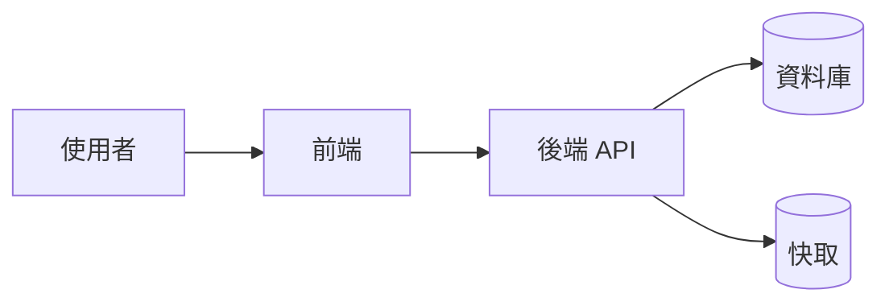
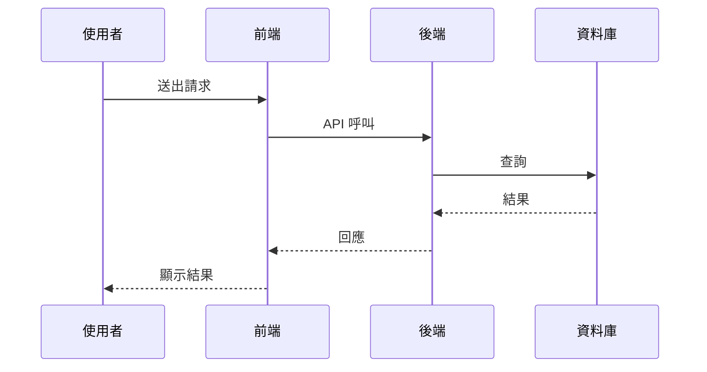

# Plan: {功能名稱}

> 建立日期: {YYYY-MM-DD}
> 狀態: 🔵 進行中 / ✅ 已完成
> 優先級: 🔴 高 / 🟡 中 / 🟢 低

---

## 目標

{這個功能要達成什麼？解決什麼問題？}

## 背景

{為什麼需要這個功能？商業動機或技術需求。若引用 Knowledge：`> 參考知識：docs/knowledge/{category}/{file}.md`}

## 關聯 PRD

<!--
  三種情境的處理方式：
  (A) 本 Plan 來自已確認的 PRD → **必填此區塊**，引用 docs/requirements/completed/ 中的 PRD 檔名
  (B) 本 Plan 由使用者提供書面規格 / 明確口述建立（需求已清楚，PRD 被豁免）→ **刪除此區塊**
  (C) 大型需求模糊但使用者指定「直接 Plan、不用 PRD」→ **刪除此區塊**，並在「背景」註明「使用者指定豁免 PRD」
-->

> **PRD**: `docs/requirements/completed/{YYYYMMDD}-{NNN}-{topic}.md`（v{版本號}，✅ 已確認）
>
> 本 Plan 的「目標」、「背景」、「受影響子專案」章節需與 PRD 對齊；若發現 PRD 有遺漏或需要調整，請回頭更新 PRD 並重新確認。

## 系統分析

<!-- 小型 / 單一檔案改動可刪除此區塊；跨專案或新功能必填 -->

### 系統目標

<!-- 系統層級的可衡量目標（KPI / NFR），與上方「目標」差異：這裡寫系統層級指標，不寫實作細節 -->

- 目標 1: {例：登入流程步驟從 5 步降為 2 步}
- 目標 2: {例：核心 API p95 回應時間 < 200ms}
- 目標 3: {例：支援 10,000 並發使用者}

### 利害關係人

| 角色 | 關注點 | 需求 |
| --- | --- | --- |
| {終端使用者 / 客服 / 風控 / 財務 / 維運 / ...} | {他最在乎什麼} | {他希望系統怎麼做} |

## 方案概述

{高層級的技術方案描述，不需要到檔案層級的細節（那是 Spec 的事）}

### 方案比較（如有多個方案）

| 方案 | 優點 | 缺點 | 結論 |
| --- | --- | --- | --- |
| 方案 A | {優點} | {缺點} | ✅ 採用 / ❌ 棄用 |
| 方案 B | {優點} | {缺點} | ✅ 採用 / ❌ 棄用 |

## 系統架構

<!-- 若改動不涉及架構調整，刪除此區塊 -->

### 技術選型

<!-- 引入新套件 / 框架 / 服務時必填；沿用既有技術棧可只列「沿用 {技術}」 -->

| 項目 | 選擇 | 理由 | 替代方案（已評估未採用） |
| --- | --- | --- | --- |
| {後端框架 / ORM / 資料庫 / 快取 / 訊息佇列 / 前端框架 / ...} | {選擇} | {選它的原因} | {方案 + 不採用原因} |

### 系統架構圖

<!-- 大型 / 跨服務時強烈建議；使用 Mermaid，GitHub / VS Code 原生渲染 -->



### 系統流程圖

<!-- 多步驟業務流程建議加；Mermaid sequenceDiagram（互動）或 flowchart（分支）擇一 -->



## 角色與權限

<!-- 無權限差異時刪除此區塊 -->

| 角色 | 可存取資源 | 可執行操作 | 限制 |
| --- | --- | --- | --- |
| {Admin / Manager / Agent / Member / Guest} | {頁面 / API / 資料範圍} | {讀 / 寫 / 刪 / 審核 / ...} | {例：僅可看自己部門資料} |

> **權限實作對應**：Spec 中需具體指出檢查點（middleware / guard / RLS / 前端路由守衛），避免只停留在需求描述。

## 受影響子專案

| 子專案 | 影響類型 | 說明 |
| --- | --- | --- |
| `prisma` | 新增/修改 | {說明} |
| `common` | 新增/修改 | {說明} |
| `admin` | 新增/修改 | {說明} |

## 資料表異動（Database Schema Changes）

<!-- ⚠️ 若本次改動「有」任何 DB schema 變更（新增 / 修改 / 刪除資料表或欄位、索引、外鍵、約束），
     AI 必須填寫此區塊，並在與使用者確認 Plan 時「主動口頭告知有資料庫異動」。
     若「無」任何變更，刪除此區塊。

     【新功能特別規定（硬性）】
     若本 Plan 為「新功能」(新增資料表，或同時新增多張關聯資料表)，AI 必須完整填寫：
       1. 異動總覽表（下方）
       2. 「新增資料表完整結構」(Prisma schema 片段或欄位明細表)
       3. 「ER 關係圖」(Mermaid erDiagram) — 觸發條件為以下任一：
            (a) 新增 2 張以上資料表
            (b) 新增資料表與既有資料表有外鍵關聯
            (c) 修改既有外鍵關聯
          只有在「單張獨立表 + 完全無外鍵關聯」時可刪除
       4. 「索引與約束」(主鍵 / 唯一鍵 / 複合索引 / 外鍵)
       5. 「Seed / 初始資料」(若該表有預設或必要資料)
       6. Migration 注意事項
     非新功能（僅修改既有欄位）可僅填「異動總覽」+「新增/修改欄位明細」+「Migration 注意事項」；
     若本次改動「有調整既有外鍵關聯」，仍須補上 ER 關係圖（Before / After）。 -->

### 異動總覽

| 資料表名稱 | 異動類型 | 說明 |
| --- | --- | --- |
| `{table_name}` | 新增資料表 / 新增欄位 / 修改欄位 / 刪除欄位 / 刪除資料表 | {說明} |

### 新增資料表完整結構（新功能必填）

<!-- 新增資料表時，AI 必須以 Prisma schema 片段呈現完整定義（含 @map、@id、@default、@relation、@@index 等），
     讓使用者可直接審閱命名、型別、關聯、預設值是否合理。
     僅修改既有欄位的情境可刪除此區塊，改用下方「新增 / 修改欄位明細」表格。 -->

```prisma
model {ModelName} {
  id          String   @id @default(cuid())
  {field}     String   @db.VarChar(255)
  {field2}    Int      @default(0)
  status      {Enum}   @default(PENDING)
  createdAt   DateTime @default(now())          @map("created_at")
  updatedAt   DateTime @updatedAt               @map("updated_at")

  // 關聯
  {relation}  {OtherModel} @relation(fields: [{fk}], references: [id])
  {fk}        String   @map("{fk_column}")

  @@index([{indexed_field}])
  @@map("{table_name}")
}

enum {Enum} {
  PENDING
  ACTIVE
  ARCHIVED
}
```

### 新增 / 修改欄位明細

| 資料表 | 欄位名稱 | 型別 | 可 NULL | 預設值 | 索引 | 說明 |
| --- | --- | --- | --- | --- | --- | --- |
| `{table}` | `{column}` | VARCHAR(255) | 否 | — | 無 | {說明} |

### ER 關係圖（涉及關聯時必填）

<!-- 觸發條件（任一成立即必填）：
       (a) 新增 2 張以上資料表
       (b) 新增資料表與既有資料表有外鍵關聯
       (c) 修改既有外鍵關聯（新增 / 變更 / 刪除）
       (d) 新增資料表本身為純獨立表，但屬「新功能」且使用者未明示豁免
     僅修改非關聯欄位（如：純改型別、改預設值）可刪除此區塊。

     【繪製規範（硬性）】
     1. 必須包含本次新增 / 異動的所有資料表
     2. 必須包含與其相鄰的「既有資料表」(只畫出 1 hop 內有外鍵關聯者)，用於提供上下文，
        既有表可只列出主鍵與用於關聯的欄位，不需列全部欄位
     3. 關聯線必須使用 Mermaid 標準語法標示基數：
          ||--||  一對一
          ||--o{  一對多 (左為一)
          }o--o{  多對多
        並在線後方加上動詞描述關聯語意 (例: "has", "owns", "assigned_to")
     4. 修改既有關聯時，請保留兩份圖：「Before」與「After」，方便 diff
     5. 欄位需標註 PK / FK / UK (唯一鍵)，型別使用 Prisma 對應的精簡名 (string / int / datetime / boolean / enum) -->

<!-- 若有「新增 / 新增關聯」 → 只需 After 圖；若有「修改 / 移除既有關聯」 → 同時提供 Before / After -->

#### Before（僅在修改既有關聯時提供，否則刪除此小節）

```mermaid
erDiagram
    {EXISTING_A} ||--o{ {EXISTING_B} : "old_relation"
    {EXISTING_A} {
        string id PK
    }
    {EXISTING_B} {
        string id PK
        string {existing_a}_id FK
    }
```

#### After

```mermaid
erDiagram
    {EXISTING_A} ||--o{ {NEW_TABLE_B} : "has"
    {NEW_TABLE_B} ||--o{ {NEW_TABLE_C} : "owns"
    {EXISTING_A} {
        string id PK
        string name "既有欄位 (僅列關聯需要的)"
    }
    {NEW_TABLE_B} {
        string id PK
        string {existing_a}_id FK
        string title
        enum   status
        datetime created_at
    }
    {NEW_TABLE_C} {
        string id PK
        string {new_table_b}_id FK
        int    sort_order
    }
```

> **既有資料表標示提示**：可在欄位後加註解 `"既有"` 與本次新增區別；若使用者偏好視覺化區分，亦可拆成兩個 erDiagram（既有 / 新增）並列。

### 索引與約束

| 資料表 | 約束類型 | 欄位 | 說明 |
| --- | --- | --- | --- |
| `{table}` | PRIMARY KEY | `id` | — |
| `{table}` | UNIQUE | `{column}` | {為何需要唯一} |
| `{table}` | INDEX | `({col_a}, {col_b})` | {查詢場景} |
| `{table}` | FOREIGN KEY | `{fk} → {ref_table}.id` | ON DELETE {CASCADE / SET NULL / RESTRICT} |

### Seed / 初始資料

<!-- 若新表需要預設資料（如：狀態枚舉對應表、預設角色），列出來；否則刪除此區塊 -->

| 資料表 | 初始資料 | 來源 |
| --- | --- | --- |
| `{table}` | {說明 N 筆預設資料} | `prisma/seed.ts` |

### Migration 注意事項

- [ ] 需要 down migration（回滾腳本）
- [ ] 影響現有資料（需資料遷移腳本）
- [ ] 影響 index（需重建）
- [ ] 外鍵約束變更
- [ ] 大資料表需評估鎖定策略（建議採用 non-blocking migration）
- [ ] 新增 NOT NULL 欄位需提供預設值或分階段 migration（先 nullable → 回填 → 改 NOT NULL）

## WBS（Work Breakdown Structure）

<!-- 大型需求建議加；小 / 中型可直接以下方「拆解的 Spec 清單」替代 -->

| 階段 | 工作包 | 對應 Spec | 預估工時 | 相依 |
| --- | --- | --- | --- | --- |
| 1. 資料層 | 1.1 Schema 設計 | `{spec-1}` | 0.5d | — |
| 1. 資料層 | 1.2 Migration 腳本 | `{spec-2}` | 0.5d | 1.1 |
| 2. 後端 | 2.1 API 實作 | `{spec-3}` | 2d | 1.2 |
| 3. 前端 | 3.1 頁面與元件 | `{spec-4}` | 1d | 2.1 |
| 4. 驗證 | 4.1 E2E 測試 | `{spec-5}` | 0.5d | 3.1 |

> **WBS 與 Spec 清單差異**：WBS 是**階段層級**的工作分解（供排程 / 人力估算），Spec 清單是**任務層級**的開發單位（AI 實際動手的單元）。一個 WBS 工作包可能對應一到多個 Spec。

## 拆解的 Spec 清單

| Spec 檔名 | 狀態 | 說明 |
| --- | --- | --- |
| `docs/specs/doing/{YYYYMMDD}-{NNN}-{task-1}.spec.md` | 🔵/✅ | {說明} |
| `docs/specs/doing/{YYYYMMDD}-{NNN}-{task-2}.spec.md` | 🔵/✅ | {說明} |

## 驗收條件

- [ ] {條件 1}
- [ ] {條件 2}

## AI 協作紀錄

> AI 依對話進展自動維護此區塊，不需使用者額外指示。

### 目標確認

{AI 與使用者確認的本次對話目標——解決什麼問題？}

### 關鍵問答

#### {問題/提示摘要}

**AI 回應摘要**: {精簡回應，保留思考脈絡}

### 決策記錄

<!-- 採納與棄用的方案均需記錄；棄用時 AI 主動追加 -->

| 決策 | 結果 | 理由 |
| --- | --- | --- |
| {方案描述} | ✅ 採納 / ❌ 棄用 | {使用者說明的原因，或 AI 推斷的原因} |

### 產出摘要

<!-- AI 完成任務後自動更新 -->

- **程式碼／設計**: {重要程式碼片段、設計思路}
- **測試案例**: {驗證方法、測試結果}
- **文件更新**: {更新的文件清單}
