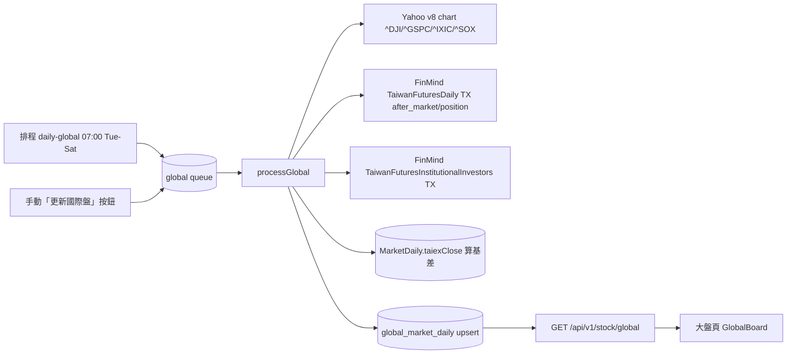

# Plan：國際盤 / 期貨夜盤（美股四大指數 + 台指期夜盤盤後籌碼）

> 建立日期: 2026-06-06
> 狀態: ✅ 已完成
> 規模: 大型（跨 prisma → common → worker → admin）
> 對應 Spec: `docs/specs/doing/20260606-014-stock-global-market.spec.md`

## 目標

台股開盤方向高度受**前一夜美股**與**台指期夜盤**牽動，但目前後台只有台股盤後資料（`MarketDaily`）。
在現有「大盤 / 類股輪動」頁最上方新增「國際盤 / 期貨夜盤」區塊，每天早上自動抓取：

- **美股四大指數**：道瓊 `^DJI`、S&P500 `^GSPC`、那斯達克 `^IXIC`、費城半導體 `^SOX`
- **台指期夜盤（完整盤後籌碼）**：夜盤收盤 + 漲跌點/%（vs 日盤結算）、期現價差(基差)、三大法人台指期未平倉

## 背景 / 沿用

整個沿用現有 `大盤` 流程：新表（仿 `MarketDaily`）→ 新 worker job（仿 `processMarket`）→ 新排程（早上、美股收盤後）→ 顯示在大盤頁。

## 系統架構

## 角色與權限

沿用既有權限，不新增：GET = `STOCK_SIGNAL_VIEW`、POST（手動更新）= `STOCK_BOT_ADMIN`。

## ⚠️ 資料表異動（硬性告知：本次有資料庫異動）

**新增 1 張表 `global_market_daily`**（Prisma model `GlobalMarketDaily`），無修改/刪除既有表。

| 欄位 | 型別 | 說明 |
| --- | --- | --- |
| `date` | DateTime @id | 抓取日（台北時區，一天一列） |
| `us_indices` | Json? | 美股指數陣列 `[{ symbol, name, close, changePct, changePoint, asOf }]` |
| `txf_night_close` | Float? | 台指期夜盤收盤（近月） |
| `txf_night_change_pct` | Float? | 夜盤漲跌%（FinMind spread_per，vs 日盤結算） |
| `txf_night_change_point` | Float? | 夜盤漲跌點（FinMind spread） |
| `txf_basis` | Float? | 期現價差 = 夜盤收盤 − 最新 `MarketDaily.taiexClose` |
| `fut_chips` | Json? | 三大法人台指期 `{ date, foreign, trust, dealer }`（各含 netOi/longOi/shortOi） |
| `updated_at` | DateTime @updatedAt | — |

Migration：`prisma migrate dev --name add_global_market_daily`。

## WBS（對應 Spec 受影響檔案）

1. prisma：`GlobalMarketDaily` + migration
2. common：`StockJobType.GLOBAL` + DTO 型別
3. worker：`us-market.ts` / `futures.ts` / `global-market.ts` + queue/job/worker/scheduler
4. admin：service + route + `GlobalBoard` 元件 + 大盤頁掛載 + 資料來源頁 + locales

## 資料來源（已實測）

| 資料 | 來源 | 端點 / Dataset | 備註 |
| --- | --- | --- | --- |
| 美股四大指數 | Yahoo Finance（免 key） | `v8/finance/chart/{symbol}?range=5d&interval=1d` | 需帶 User-Agent；取最近兩根日 K 算漲跌 |
| 台指期夜盤 | FinMind | `TaiwanFuturesDaily` data_id=TX trading_session=after_market | 取「近月（contract_date 6 碼、vol>0 最小）」最新日；用 spread/spread_per |
| 台指期日盤 | FinMind | `TaiwanFuturesDaily` …=position | 比對 / 備援 |
| 三大法人台指期 | FinMind | `TaiwanFuturesInstitutionalInvestors` data_id=TX | 外資/投信/自營商，netOi = long_oi − short_oi |

> after_market 的 open_interest 恆為 0 → 未平倉一律取自 `TaiwanFuturesInstitutionalInvestors`。
> after_market 日期 = 次一交易日（FinMind 慣例）。

## AI 協作紀錄

### 目標確認
> 把「美股四大指數 + 台指期夜盤盤後籌碼」放進後台大盤頁，協助判斷隔日台股開盤方向。

### 關鍵問答
- 美股指數範圍 → 採「四大指數（含費半 SOX）」：SOX 對台股電子/半導體最具領先性。
- 顯示位置 → 併入現有 `/stock-bot/market` 大盤頁最上方。
- 夜盤細節 → 完整盤後籌碼（夜盤漲跌 + 期現價差 + 三大法人未平倉）。
- 資料源 → 美股用 Yahoo（免 key）、期貨用既有 FinMind；實測確認可取近月夜盤 close 與三大法人 OI。

### 決策記錄
| 決策 | 狀態 | 原因 |
| --- | --- | --- |
| 美股用 Yahoo Finance v8 chart | ✅ 採納 | 免 key、四大指數皆可取、回 JSON |
| 夜盤漲跌直接用 FinMind `spread`/`spread_per` | ✅ 採納 | 已是 vs 前一結算的漲跌，免自行計算 |
| US 指數 / 三大法人存 JSON 欄位 | ✅ 採納 | 仿 `MarketDaily.sectors`，日後加 VIX/DXY 免改 schema |
