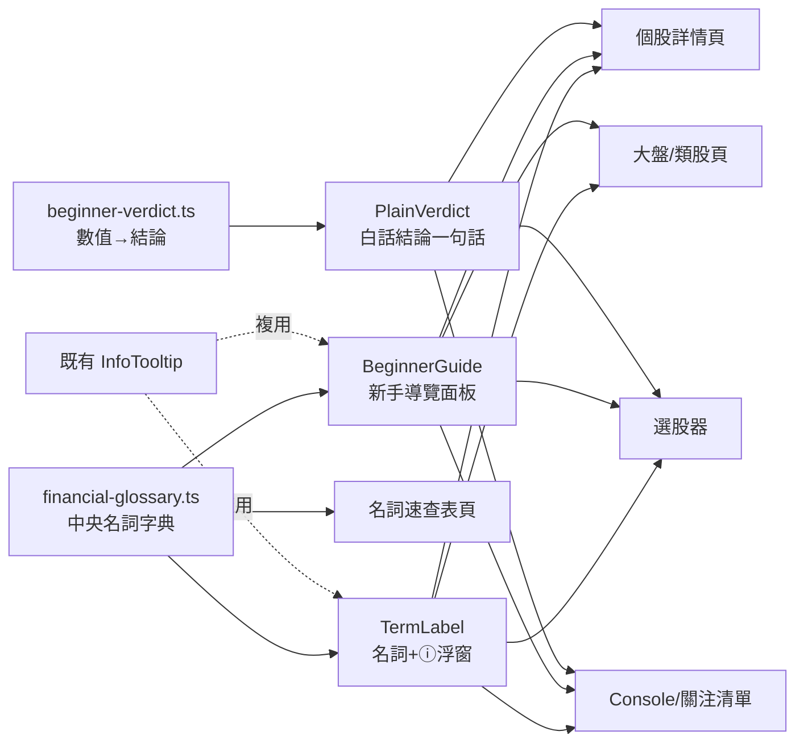

# Plan: 股票機器人 — 全站新手友善化（名詞解釋 / 白話結論 / 圖解）

> 建立日期: 2026-06-06
> 狀態: ✅ 已完成
> 優先級: 🟡 中

---

## 目標

讓**完全不懂股票的使用者（小白）**也能看懂後台每一頁的數據。在四大頁面（個股詳情 / 選股器 / 大盤類股 / Console 含關注清單）以四種形式補上解釋：

1. **滑鼠浮窗（tooltip）** — 名詞旁放 ⓘ，滑過 / 點擊看白話解釋
2. **白話結論一句話** — 把數值直接翻成判斷（例：本益比 12 →「偏便宜」）
3. **獨立說明區塊** — 每頁可收合的「📖 新手導覽」面板 + 一頁總「名詞速查表」
4. **範例 + 圖解** — 名詞附具體算式 / 例子（例：股價 100、EPS 5 → 本益比 20 倍）

## 背景

使用者（專案擁有者）回饋「需要有更多的解釋，讓小白可以看的懂」，並於釐清時選擇「四頁全做 + 四種形式全做」。

現況盤點（已存在的新手友善基礎）：

- 已有純 CSS 浮窗元件 [`info-tooltip.tsx`](../../../admin/src/components/stock/info-tooltip.tsx)（spec 019），但說明文字**散落寫死**在各頁面，無統一字典。
- 選股器（spec 019）、K 線圖圖例（spec 015）、KD 紅綠燈結論卡（spec 014）已具雛形，可作為 pattern 參考與複用對象。
- 個股詳情頁、大盤頁、Console、關注清單**幾乎沒有解釋**。

> 參考實作：`admin/src/components/stock/info-tooltip.tsx`、`admin/src/app/(dashboard)/stock-bot/console/StockVerdictCard.tsx`、`admin/src/config/data-sources.ts`（中央設定檔 pattern）

**使用者指定豁免 PRD**：需求已透過釐清問答明確（四頁 × 四形式），規模雖大但無開放問題，直接進入 Plan。

## 系統分析

### 系統目標

- 目標 1：四大頁面所有專有名詞 100% 可查（滑過 ⓘ 或查速查表皆可得到白話解釋）
- 目標 2：關鍵數值（本益比 / 殖利率 / 健診評分 / 營收 YoY / 動作）提供「白話結論」，使用者不需自行判讀
- 目標 3：名詞解釋**單一真實來源**（中央字典），全站引用，改一處即全站同步
- 目標 4：零新增執行時依賴、零資料庫異動、不破壞既有頁面與深色模式

### 利害關係人

| 角色 | 關注點 | 需求 |
| --- | --- | --- |
| 小白使用者 | 看不懂專有名詞與數字 | 滑過就有白話解釋、有結論、有例子 |
| 進階使用者 | 不想被囉嗦說明干擾 | 解釋採「漸進揭露」(ⓘ / 可收合面板)，不擋畫面 |
| 開發者（維護） | 說明文案散落難維護 | 中央字典統一管理，新增頁面直接複用元件 |

## 方案概述

採「**中央字典 + 可複用元件 + 各頁套用**」三層：

1. **字典層**：新增 `config/financial-glossary.ts`，每個名詞一筆，含 `term / aka / short（浮窗一句話）/ detail（詳解）/ example（範例圖解）`。
2. **元件層**：建立 4 個可複用元件 / 工具，分別對應四種形式（皆複用既有 `InfoTooltip`，純 CSS、無新依賴）。
3. **套用層**：四大頁面引入元件，名詞改用 `TermLabel`、關鍵數值加 `PlainVerdict`、每頁頂部加 `BeginnerGuide`；另建一頁「名詞速查表」並掛上選單。

### 方案比較

| 方案 | 優點 | 缺點 | 結論 |
| --- | --- | --- | --- |
| A. 中央字典 + 元件複用 | 單一真實來源、好維護、四種形式共用一份文案 | 需先建地基 | ✅ 採用 |
| B. 各頁面就地寫死說明（沿用 019 做法） | 起步快 | 文案重複、難維護、四頁會大量重複 | ❌ 棄用 |

## 系統架構

### 技術選型

| 項目 | 選擇 | 理由 | 替代方案（已評估未採用） |
| --- | --- | --- | --- |
| 浮窗 | 沿用 `InfoTooltip`（純 CSS group-hover / focus-within） | 無新依賴、手機可點、深色模式相容 | RizzUI `Popover`（需 JS 狀態，殺雞用牛刀） |
| 字典 | 沿用 `data-sources.ts` 的中央設定檔 pattern | 與既有慣例一致 | 散落各頁（維護差，已棄用） |

### 系統架構圖

## 角色與權限

沿用既有權限，新頁面套用相同守衛，無新增權限。

| 角色 | 可存取資源 | 限制 |
| --- | --- | --- |
| 具 `STOCK_SIGNAL_VIEW` 權限者 | 新增的「名詞速查表」頁 | 與其他股票頁一致 |

> **權限實作對應**：名詞速查頁選單項 `requiredPermission: PERMISSIONS.STOCK_SIGNAL_VIEW`，與 console/screener 一致。

## 受影響子專案

| 子專案 | 影響類型 | 說明 |
| --- | --- | --- |
| `prisma` | ❌ 無 | 無 schema 變更 |
| `common` | ❌ 無 | 無共用型別變更 |
| `admin` | 新增 + 修改 | 新增字典 / 元件 / 速查頁；四大頁面套用；route / 選單 / i18n 補入口 |

> ✅ **本次無任何資料庫異動**（純前端 UI），故刪除「資料表異動」區塊。

## WBS（Work Breakdown Structure）

| 階段 | 工作包 | 對應 Spec | 相依 |
| --- | --- | --- | --- |
| 1. 地基 | 字典 + 4 元件/工具 | `20260606-020` | — |
| 2. 速查頁 | 名詞速查表頁 + route + 選單 + i18n | `20260606-020` | 1 |
| 3. 套用 | 四大頁面引入元件 | `20260606-020` | 1 |
| 4. 驗證 | `npm run type:check` + 手動目視 | `20260606-020` | 1-3 |

## 拆解的 Spec 清單

| Spec 檔名 | 狀態 | 說明 |
| --- | --- | --- |
| `docs/specs/doing/20260606-020-stock-beginner-friendly.spec.md` | ✅ | 全站新手友善化：字典 + 元件 + 四頁套用 + 速查頁 |

## 驗收條件

- [ ] 四大頁面所有專有名詞旁有 ⓘ 或可於速查表查到
- [ ] 本益比 / 殖利率 / 健診評分 / 營收 YoY / 動作 顯示白話結論
- [ ] 每頁有可收合「📖 新手導覽」；選單有「名詞速查」入口
- [ ] 字典為單一來源，頁面不再寫死重複文案
- [ ] `npm run type:check` 通過、深色模式可讀、不破壞既有功能

## AI 協作紀錄

### 目標確認

讓小白看得懂股票後台四大頁面的所有數據，補上浮窗 / 白話結論 / 說明區塊 / 範例圖解四種解釋。

### 關鍵問答

#### 範圍與形式

**AI 回應摘要**：以兩題澄清確認使用者要「四頁全做 + 四形式全做」，再以一題確認推進策略為「一次全做」。

#### 推進策略

**AI 回應摘要**：建議「樣板先行」最低風險，但使用者選「一次全做」，故一次涵蓋四頁四形式。

### 決策記錄

| 決策 | 結果 | 理由 |
| --- | --- | --- |
| 中央字典 + 元件複用（方案 A） | ✅ 採納 | 單一來源、四頁四形式共用文案、好維護 |
| 各頁就地寫死（方案 B，沿用 019） | ❌ 棄用 | 四頁會大量重複、難維護 |
| 一次全做（vs 樣板先行） | ✅ 採納 | 使用者明確選擇 |
| 新增獨立「名詞速查表」頁 + 選單入口 | ✅ 採納 | 小白需要明顯的全站查詢入口（獨立說明區塊形式之一） |

### 產出摘要

- **程式碼／設計**：建立中央名詞字典 `financial-glossary.ts`（33 名詞 × 四層深淺）為單一真實來源；4 個可複用元件/工具（`TermLabel` 浮窗、`PlainVerdict` 白話結論、`BeginnerGuide` 導覽、`beginner-verdict` 數值→結論）；新增 `/stock-bot/glossary` 速查表頁並掛上選單。四大頁面（選股器 / 個股詳情 / 大盤+global-board / Console）全面套用，選股器既有寫死浮窗一併重構至字典。
- **測試案例**：`npm run type:check`（admin + worker）零錯誤通過。UI 目視（hover / 深色模式 / 導覽收合）待實機確認。
- **文件更新**：本 Plan + Spec `20260606-020`；共 13 個程式碼檔（5 新增地基 + 1 速查頁 + 2 設定/選單 + 5 頁面）＋ 2 locale JSON。
- **後續可選**：標準化選股器「動作」欄與關注清單「評分」欄是否也加 `PlainVerdict`（目前僅標題浮窗 + 顏色）；K 線圖 legend 未來可改接字典統一維護。
