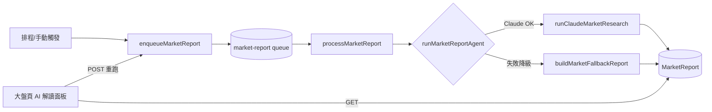

# Plan: 股票機器人 — 大盤 AI 盤勢解讀報告

> 建立日期: 2026-06-06
> 狀態: ✅ 已完成
> 優先級: 🟡 中

---

## 目標

在「大盤 / 類股輪動」頁面提供 **AI 盤勢解讀報告**：彙整加權指數、市場廣度、類股輪動、國際盤（美股四大指數）、台指期夜盤、三大法人未平倉等已落庫資料，交給 Claude 產出一篇繁體中文白話盤勢解讀；報告落庫、可重跑、每日排程自動產生。Claude 不可用時自動降級為「資料摘要版」。

## 背景

大盤頁目前只有數據看板，沒有任何文字解讀，新手難以判讀「今天盤勢到底偏多還偏空、為什麼」。專案已有成熟的個股研究報告管線（Deep Agent + Claude + 降級保底 + 落庫 + job 佇列），本功能複用同一套路，擴展到「大盤層級」。

> 使用者指定豁免 PRD（需求明確：落庫＋可重跑＋用 Claude CLI）。

> 參考實作：個股研究管線 `worker/src/agent/deepAgent.ts`、`worker/src/agent/claudeResearch.ts`、`worker/src/jobs/research.ts`、`prisma` 的 `ResearchReport`。

## 方案概述

新增一條獨立 job 佇列 `market-report`（與個股 `research` 分離，因 LLM 慢、需低並行、且觸發節奏不同於大盤資料抓取）：

```
[排程/手動] → enqueueMarketReport → market-report queue
   → processMarketReport → runMarketReportAgent()
        ├─ 嘗試 runClaudeMarketResearch()（讀 MarketDaily + GlobalMarketDaily → 組 facts → claudeReason → 解析 JSON）
        └─ 失敗 → buildMarketFallbackReport()（純資料摘要，標記 degraded=true）
   → upsert MarketReport（以 reportDate 去重）
[大盤頁] GET /api/v1/stock/market/report → 顯示最新一篇；POST 觸發重跑
```

- Claude 授權：沿用 `claudeReason()`，env 未設金鑰時 SDK 自動使用本機登入的 `claude` CLI session（使用者指定用法）。
- 降級判斷：與個股一致，`runClaudeMarketResearch` 拋錯（無回應/無法解析）→ orchestrator catch → fallback。fallback 報告標記 `degraded=true`，前端顯示「資料摘要版（未經 AI 深度研判）」。

### 方案比較

| 方案 | 優點 | 缺點 | 結論 |
| --- | --- | --- | --- |
| A. 獨立 `market-report` 佇列 + 新 model | 與 research 模式一致、低並行不影響大盤抓取、可獨立排程/重跑/留歷史 | 樣板較多（common/worker/admin 各處註冊） | ✅ 採用 |
| B. 併入既有 `market` job 內順便產生 | 檔案少 | 每次抓大盤資料都觸發慢速 LLM；無法獨立重跑；耦合 | ❌ 棄用 |
| C. 即時產生不落庫 | 最簡單 | 無歷史、每次都等 LLM、使用者明確要落庫 | ❌ 棄用 |

## 系統架構

### 技術選型

| 項目 | 選擇 | 理由 | 替代方案 |
| --- | --- | --- | --- |
| LLM | 沿用 Claude（`@anthropic-ai/claude-agent-sdk` 的 `claudeReason`） | 專案 Claude-only，管線已就緒 | — |
| 佇列 | 沿用 BullMQ，新增 `market-report` queue | 與既有 6 條佇列一致 | 併入 market（已棄用） |
| Markdown 渲染 | `whitespace-pre-wrap` 純文字（零依賴） | admin 無 markdown 套件；lint 工具鏈失效不宜加依賴 | react-markdown（不採用） |

### 系統架構圖



## 角色與權限

沿用既有股票權限：讀取與觸發都用 `PERMISSIONS.STOCK_SIGNAL_VIEW`（與 market / screener 一致）。不新增角色。

## WBS（受影響子專案，開發順序：prisma → common → worker → admin）

| # | 子專案 | 工作 |
| --- | --- | --- |
| 1 | prisma | 新增 `MarketReport` model + migration |
| 2 | common | `StockJobType.MARKET_REPORT`；`MarketReportDto` 型別 |
| 3 | worker | queue/enqueue、`claudeMarketResearch.ts`、`marketReportAgent.ts`、processor、worker 註冊、（可選）scheduler |
| 4 | admin | stock-queue（enqueue + 監控 + 排程註冊）、stock-service（get/list/trigger）、API route、大盤頁 AI 面板 |

## 受影響子專案

| 子專案 | 是否受影響 | 說明 |
| --- | --- | --- |
| `prisma` | ✅ | 新增 `MarketReport` 資料表（**DB 異動**，見下） |
| `common` | ✅ | 新增 job type 常數 + DTO 型別 |
| `admin` | ✅ | producer / service / API / 大盤頁 UI |
| `worker` | ✅ | queue / agent / processor / worker 註冊 |

## ⚠️ 資料表異動（本次有資料庫異動）

**受影響資料表：新增 1 張 `market_report`**

| 資料表 | 欄位 | 異動類型 | 詳細說明 |
| --- | --- | --- | --- |
| `market_report` | `id` | 新增 | `String @id @default(cuid())` |
| | `report_date` | 新增 | `DateTime @db.Date @unique`，每日一篇去重鍵 |
| | `title` | 新增 | `String` 報告標題 |
| | `summary` | 新增 | `String @db.Text` 3~5 句摘要 |
| | `body` | 新增 | `String @db.Text` Markdown 全文 |
| | `sentiment` | 新增 | `String?` bullish/neutral/bearish |
| | `degraded` | 新增 | `Boolean @default(false)` true=降級資料摘要版 |
| | `created_at` | 新增 | `DateTime @default(now())` |

Migration 注意事項：
- [x] 純新增資料表，**不影響任何現有資料**、無外鍵、無 index 重建
- [ ] 需 down migration：`prisma migrate` 自動產生；回滾即 drop table
- 指令：`npm run prisma:migrate`（migration 名稱建議 `add_market_report`）→ `npm run prisma:generate`

## 拆解的 Spec

- `docs/specs/doing/20260606-020-market-ai-report.spec.md`（單一 Spec 涵蓋四個子專案）

## 風險評估

- Claude CLI session 未登入時：自動走 fallback，使用者仍看得到資料摘要版（已驗證 `claudeReason` env 無金鑰也會嘗試 CLI）。
- worker 未啟動：job 入列但不消化，UI 顯示「產生中」後逾時無新報告——沿用 market 既有 10s 後重新整理體驗，並提示可能需稍候。
- LLM 產 JSON 失敗：`extractJson` 容錯 + 失敗即降級。
- 跨 workspace 型別：`MarketReportDto` 放 common，worker 與 admin 共用。

## AI 協作紀錄

### 目標確認

大盤頁新增 AI 盤勢解讀報告，落庫＋可重跑，用 Claude CLI，Claude 不可用時降級資料摘要版。

### 關鍵問答

#### 產生方式？
**AI 回應摘要**: 使用者選「落庫＋可重跑（完整版）」→ 採獨立佇列 + MarketReport model + 排程，複用 research 管線。

#### 金鑰？
**AI 回應摘要**: 使用者用 Claude CLI。確認 `claudeReason()` 不檢查 env，會沿用本機 CLI session；`isClaudeAvailable()` 僅看 env，故大盤 orchestrator 不以它為 gate，直接嘗試呼叫、失敗才降級。

### 決策記錄

| 決策 | 結果 | 理由 |
| --- | --- | --- |
| 獨立 market-report 佇列（方案 A） | ✅ 採納 | 低並行不卡大盤抓取、可獨立重跑/排程 |
| 併入 market job（方案 B） | ❌ 棄用 | 每次抓資料都觸發慢 LLM、耦合 |
| 即時不落庫（方案 C） | ❌ 棄用 | 使用者要落庫＋歷史 |
| Markdown 用 whitespace-pre-wrap | ✅ 採納 | 零依賴，lint 工具鏈失效不宜加套件 |
