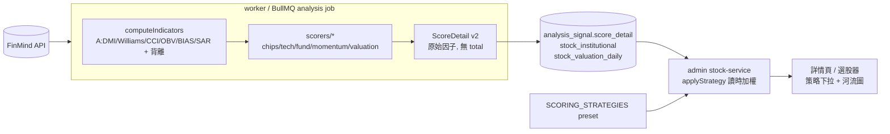
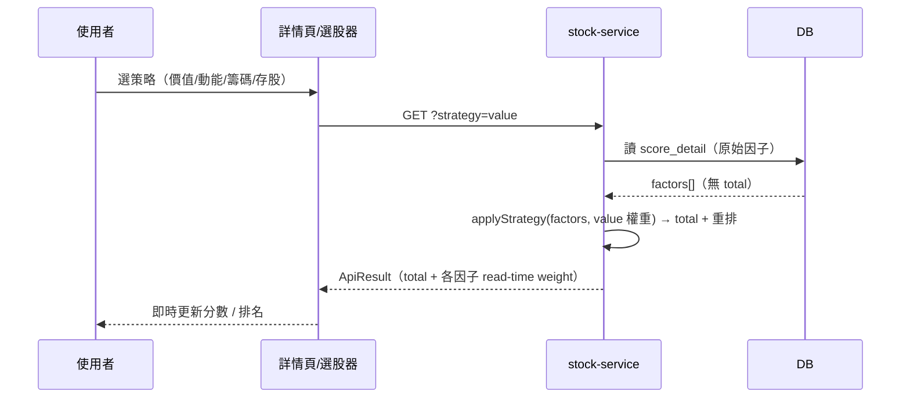
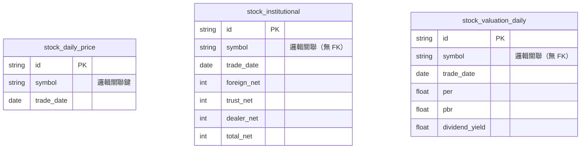

# Plan: 進階投資策略指標 + 多策略可調權重評分模型

> 建立日期: 2026-06-07
> 狀態: ✅ 已完成
> 優先級: 🟡 中

---

## 目標

對標市售軟體（XQ 全球贏家、CMoney 籌碼K線、三竹、財報狙擊手）補齊一整批投資策略指標，並把固定權重的三因子評分升級為**可調權重 / 多策略評分**：

- **A 趨勢動能技術指標**：DMI/ADX、威廉 %R、CCI、OBV、乖離率 BIAS、SAR 拋物線停損
- **B 背離與籌碼進階**：MACD/RSI 背離、量價背離、三大法人連續買賣超天數、籌碼集中度
- **C 估值河流圖**：本益比河 / 股價淨值比河 / 殖利率河流帶 + 估值位階
- **D 策略選股模板**：法人連買、月營收創新高、突破年線、高殖利率存股、均線多頭+量增、GARP 成長價值
- **全整合**：新指標同時進入「多因子評分 / 規則訊號 / 警報 / 詳情頁顯示 / 新手名詞字典」

## 背景

目前技術分析只有 MA/EMA/RSI/MACD/KD/Bollinger/量能比 + K 線型態（`worker/src/ta/indicators.ts`），評分是固定權重三因子（籌碼 40% / 技術 35% / 基本 25%，寫死在 `worker/src/ta/score.ts`）。投資人在市售軟體天天看的趨向、背離、法人連買、估值河流、策略選股都還沒有。使用者要求補齊並升級評分模型為可依策略切換權重。

> 使用者指定豁免 PRD（需求已透過 plan-mode 對話逐題確認，規模大型但需求明確）。

## 系統分析

### 系統目標

- 個股詳情頁能呈現市售軟體等級的趨勢動能指標 + 估值河流圖，並附新手白話解讀。
- 同一份每日 precomputed 分析結果，可依使用者選的策略（綜合 / 價值 / 動能 / 籌碼 / 存股）**read-time 即時重新加權與重新排名**，不需重跑 worker。
- 選股器新增 6 個策略模板，與既有 4 個並存，共用宣告式 registry。
- 新增指標不破壞既有 `analysis_signal` 舊資料（向後相容）。

### 利害關係人

| 角色 | 關注點 | 需求 |
| --- | --- | --- |
| 一般投資人（小白） | 看得懂、能照做 | 指標要有白話解讀 + 紅綠燈，能一鍵切換投資風格策略 |
| 進階使用者 | 自訂選股邏輯 | 可調因子權重、用策略模板掃出符合條件的股票 |
| 系統維運 | 穩定、不爆 FinMind 限流 | 估值歷史與既有抓取共用呼叫，全量回填僅在空表時跑 |

## 方案概述

核心支點：**Worker 只算並儲存「每因子原始 0–100 子分數 + reason」（無 total、無權重）到 `analysis_signal.score_detail`；total 與排序在 admin READ 時，依使用者選的策略 preset 套權重即時算出。**

因子集合由 3 升 5：`chips / tech / fund / momentum / valuation`。
- `momentum`（新）承載 A 類指標 + B 類背離。
- `valuation`（新）承載 C 類河流位階 + 殖利率。
- `fund` 收斂為純成長/獲利品質（營收 YoY/MoM + EPS）。

策略 preset 為程式常數（非 DB），自訂權重經 query param 即時套用（MVP 不落 DB）。

### 方案比較

| 方案 | 優點 | 缺點 | 結論 |
| --- | --- | --- | --- |
| A. Worker 存原始因子，admin read-time 加權 | 切策略零重算、舊資料可相容、選股即時重排 | service 讀取邏輯較重 | ✅ 採用 |
| B. Worker 直接存加權 total | 讀取簡單 | 換策略要重跑全 pool、無法即時 | ❌ 棄用 |
| C. 估值河流 on-demand 即時抓 FinMind | 不需新表 | 多年逐日序列每次重抓，爆限流且慢 | ❌ 棄用 |
| D. 估值河流逐日落庫 `stock_valuation_daily` | 一次抓、可重用、選股可讀 | 需新表 + migration | ✅ 採用 |

## 系統架構

### 技術選型

| 項目 | 選擇 | 理由 | 替代方案（已評估未採用） |
| --- | --- | --- | --- |
| 技術指標庫 | 沿用 `technicalindicators@3.1.0`（已內建 ADX/WilliamsR/CCI/OBV/PSAR） | 零新依賴，與既有 SMA/RSI/MACD 同庫 | 自實作全部（重工、易錯） |
| 估值河流圖前端 | TradingView `lightweight-charts`（與既有 `KlineChart.tsx` 同棧） | 零新依賴、互動一致 | echarts（僅 server 端 chart.ts 用，client 不引入） |
| 策略 preset | 程式常數 `common/src/scoring-strategy.ts` | 跨 worker/admin 共用契約、零 migration | DB 表（首版過度設計，空表） |
| 因子加權時機 | admin read-time `applyStrategy` | 切策略零重算 | worker 落庫 total |

### 系統架構圖



### 系統流程圖



## 角色與權限

| 角色 | 可存取資源 | 可執行操作 | 限制 |
| --- | --- | --- | --- |
| `STOCK_SIGNAL_VIEW` | 詳情頁 / 選股器 / 估值 / 策略端點 | 讀、切策略、臨時調權重 | 唯讀分析資料 |
| `STOCK_BOT_ADMIN` | 監控頁 / 觸發分析 | 觸發 analysis、看 job log | — |

> **權限實作對應**：新端點 `/api/v1/stock/strategies`、`/api/v1/stock/valuation` 沿用既有 `withPermission(STOCK_SIGNAL_VIEW)` 守衛。

## 受影響子專案

| 子專案 | 影響類型 | 說明 |
| --- | --- | --- |
| `prisma` | 修改 | 新增 `stock_institutional`、`stock_valuation_daily` 兩表；`AlertType` enum 加值；`analysis_signal` 加 `institutional_streak`、`valuation_zone` 兩小欄位 |
| `common` | 新增/修改 | `stock-types.ts` 擴 `StockIndicators` + `ScoreFactor.key` + `ScoreDetail`；新 `scoring-strategy.ts`、`valuation-bands.ts` |
| `worker` | 新增/修改 | `ta/indicators.ts`、`signals.ts`、`score.ts`(拆 `scorers/*`)、`chipSignals.ts`、`data/{institutional,valuation}.ts`、`jobs/analysis.ts`、`alerts.ts` |
| `admin` | 新增/修改 | `stock-service.ts`、`screen-strategies.ts`(新)、glossary、verdict、route(strategies/valuation)、詳情頁/選股頁 |

## 資料表異動（Database Schema Changes）

> ⚠️ **本次有資料庫異動。** 新增 2 張獨立表 + 既有表加 2 小欄位 + enum 加值。

### 異動總覽

| 資料表名稱 | 異動類型 | 說明 |
| --- | --- | --- |
| `stock_institutional` | 新增資料表 | 三大法人逐日買賣超（外資/投信/自營/合計，張） |
| `stock_valuation_daily` | 新增資料表 | 逐日 PER/PBR/殖利率歷史序列 |
| `analysis_signal` | 新增欄位 | `institutional_streak Int?`、`valuation_zone String?`（供選股器查詢） |
| `AlertType`（enum） | 新增值 | `ADX_TREND_START`/`BIAS_EXTREME_HIGH`/`BIAS_EXTREME_LOW`/`DIVERGENCE_BULLISH`/`DIVERGENCE_BEARISH`/`INSTITUTIONAL_STREAK`/`VALUATION_CHEAP`/`VALUATION_EXPENSIVE` |

### 新增資料表完整結構

```prisma
model StockInstitutional {
  id         String   @id @default(cuid())
  symbol     String
  tradeDate  DateTime @map("trade_date") @db.Date
  foreignNet Int      @map("foreign_net")   // 外資買賣超淨額（張）
  trustNet   Int      @map("trust_net")     // 投信
  dealerNet  Int      @map("dealer_net")    // 自營商
  totalNet   Int      @map("total_net")     // 三大法人合計
  createdAt  DateTime @default(now()) @map("created_at")

  @@unique([symbol, tradeDate])
  @@index([symbol, tradeDate])
  @@map("stock_institutional")
}

model StockValuationDaily {
  id            String   @id @default(cuid())
  symbol        String
  tradeDate     DateTime @map("trade_date") @db.Date
  close         Float?
  per           Float?
  pbr           Float?
  dividendYield Float?   @map("dividend_yield")
  createdAt     DateTime @default(now()) @map("created_at")

  @@unique([symbol, tradeDate])
  @@index([symbol, tradeDate])
  @@map("stock_valuation_daily")
}
```

### 新增 / 修改欄位明細

| 資料表 | 欄位名稱 | 型別 | 可 NULL | 預設值 | 索引 | 說明 |
| --- | --- | --- | --- | --- | --- | --- |
| `analysis_signal` | `institutional_streak` | Int | 是 | — | 無 | 三大法人連續買賣超天數（正=連買、負=連賣），供選股器 |
| `analysis_signal` | `valuation_zone` | String | 是 | — | 無 | 估值位階字串 cheap/fair/expensive/unknown，供選股器 |

### ER 關係圖（After）

> 兩張新表皆為獨立的逐日快取表（無外鍵關聯，與既有 `stock_daily_price` / `stock_chip` 同設計），以 `symbol` 邏輯關聯，不建實體 FK。



### 索引與約束

| 資料表 | 約束類型 | 欄位 | 說明 |
| --- | --- | --- | --- |
| `stock_institutional` | PRIMARY KEY | `id` | — |
| `stock_institutional` | UNIQUE | `(symbol, trade_date)` | 每檔每日一列（upsert key） |
| `stock_institutional` | INDEX | `(symbol, trade_date)` | 依檔依日查 streak |
| `stock_valuation_daily` | PRIMARY KEY | `id` | — |
| `stock_valuation_daily` | UNIQUE | `(symbol, trade_date)` | 每檔每日一列（upsert key） |
| `stock_valuation_daily` | INDEX | `(symbol, trade_date)` | 多年序列範圍查詢 |

### Migration 注意事項

- [x] 需要 down migration（`DROP TABLE` 兩表 + 移除 enum 值需重建 type / drop 欄位）
- [ ] 影響現有資料（純新增，無既有資料遷移）
- [x] 影響 index（兩新表各建 unique + index）
- [ ] 外鍵約束變更（無 FK）
- [x] enum 加值需獨立 migration（PG `ALTER TYPE ... ADD VALUE` 不可與其他 DDL 同 txn）
- [x] migrate 後立即 `prisma generate`，否則 `prisma.stockInstitutional` 型別不存在 → type:check 失敗
- 落地順序：`prisma:migrate` → `prisma:generate` → rebuild common → worker → admin

## WBS（Work Breakdown Structure）

| 階段 | 工作包 | 對應 Spec | 預估工時 | 相依 |
| --- | --- | --- | --- | --- |
| 1. 評分骨架 | 1.1 ScoreDetail v2 + applyStrategy + preset + score.ts 拆層 | `adjustable-scoring-model` | 1.5d | — |
| 2. 技術指標 | 2.1 A 類指標 + 背離 + momentum scorer + 訊號/警報 | `technical-indicators` | 1.5d | 1.1 |
| 3. 法人籌碼 | 3.1 `stock_institutional` + streak + chips scorer 增強 | `divergence-and-institutional` | 1d | 1.1, 2.1 |
| 4. 估值河流 | 4.1 `stock_valuation_daily` + 河流帶 + valuation scorer + 圖 | `valuation-river` | 1.5d | 1.1 |
| 5. 策略選股 | 5.1 registry + 6 策略 + UI 重排 | `strategy-screener` | 1d | 1.1, 3.1, 4.1 |
| 6. 驗證 | 6.1 type:check / vitest / migrate / UI | 各 Spec 內 | 0.5d | 全部 |

## 拆解的 Spec 清單

| Spec 檔名 | 狀態 | 說明 |
| --- | --- | --- |
| `docs/specs/doing/20260607-001-adjustable-scoring-model.spec.md` | ✅ | 可調權重評分骨架（最先做） |
| `docs/specs/doing/20260607-002-technical-indicators.spec.md` | ✅ | A 趨勢動能技術指標 + 背離 |
| `docs/specs/doing/20260607-003-divergence-and-institutional.spec.md` | ✅ | B 法人籌碼落庫 + streak（migration） |
| `docs/specs/doing/20260607-004-valuation-river.spec.md` | ✅ | C 估值河流圖（migration） |
| `docs/specs/doing/20260607-005-strategy-screener.spec.md` | ✅ | D 策略選股模板 |

> 實作順序：001 →（002 與 003/004 的 migration 合併一次跑）→ 005。001 先定義因子契約，A/B/C 補對應 scorer 實作，D 純 read-time 最後做。

## 驗收條件

- [ ] `analysis_signal.score_detail` 寫入為 v2 五因子結構（chips/tech/fund/momentum/valuation）
- [ ] 詳情頁基本面 tab 顯示估值河流圖；切策略下拉時總分與因子權重即時變化
- [ ] 選股器可切 6 個新策略，欄位/排序正確，表頭浮窗與紅綠燈正常
- [ ] 舊 `score_detail`（v1）row 在 read-time 加權不報錯、總分合理（normalizeWeights 容錯）
- [ ] `npm run type:check` 各 workspace 通過；`vitest` 新案例綠
- [ ] ETF（0050/0056）河流圖回「資料不足」不崩；FinMind 單源失敗 analysis job 仍完成

## AI 協作紀錄

### 目標確認

補齊市售軟體等級的投資策略指標（A 技術動能 / B 背離籌碼 / C 估值河流 / D 策略選股），全整合進評分/訊號/警報/UI，並把固定權重評分升級為可調權重多策略。

### 關鍵問答

#### 指標範圍與整合深度？

**AI 回應摘要**: 透過 AskUserQuestion 確認 → 四類全做、全整合、評分模型升級為「可調權重 / 多策略評分」。

#### 評分權重要寫死還是可調？如何不重跑 worker 就能換策略？

**AI 回應摘要**: 採 worker 存原始因子 + admin read-time `applyStrategy` 加權；preset 用程式常數、自訂權重走 query param，舊資料以 `normalizeWeights` 容錯。

### 決策記錄

| 決策 | 結果 | 理由 |
| --- | --- | --- |
| Worker 存原始因子、admin read-time 加權 | ✅ 採納 | 切策略零重算、舊資料相容、選股即時重排 |
| 估值河流逐日落庫（非 on-demand） | ✅ 採納 | 多年序列重抓爆限流；現有表只存最新一筆 |
| 估值獨立成第 5 因子（殖利率移入） | ✅ 採納 | 存股/價值策略要能讓估值主導權重 |
| `stock_institutional` 採一日一列（外資/投信/自營/合計欄位） | ✅ 採納 | streak/集中度查詢方便，符合既有逐日快取設計 |
| `ScoringProfile` 自訂權重持久化 | ❌ 棄用（預留） | 首版用 query param 即可，避免空表 |
| 估值河流前端用 lightweight-charts | ✅ 採納 | 與既有 KlineChart 同棧，零新依賴 |

### 產出摘要

- **程式碼／設計**: 待實作後補充。
- **測試案例**: 待實作後補充。
- **文件更新**: 本 Plan + 5 份 Spec。
