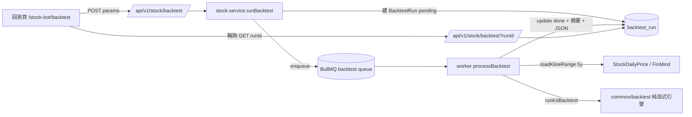

# Plan: 股票機器人 — KD 策略回測（單一個股）

> 建立日期: 2026-06-07
> 狀態: ✅ 已完成
> 關聯 PRD: 無（使用者口述需求明確 + 規模雖大但已逐題確認 4 項決策，豁免 PRD）

---

## 目標

讓使用者輸入一檔股票代號與可調 KD 參數，由背景 worker 以近 5 年歷史日 K **逐日模擬 KD 策略買賣**，
落庫回測結果，前端呈現：**賺賠比例（勝率）/ 5 年總損益金額 / 風險指標 / 權益曲線 / 交易明細**。

回答使用者三問：
1. 賺錢賠錢的比例 → 勝率、獲利因子、平均盈虧。
2. 5 年下來賺多少錢 → 最終資金、總報酬%、年化報酬（CAGR）、買進持有對照。
3. 風險性 → 最大回撤、波動度、類夏普值、平均持有天數、單筆最大虧損。

## 背景

專案已有：KD 計算（`worker/src/ta/indicators.ts`、`admin/src/lib/kd-verdict.ts` 的純函式 `stochastic()`）、
K 線圖買賣箭頭（`computeKdMarkers`）、三層 service、BullMQ 佇列、`run-tracker` job 追蹤、
無限存量的歷史日 K（`StockDailyPrice`）。但**完全沒有任何 backtest 程式碼**，為全新功能。

> 參考既有實作：`admin/src/lib/kd-verdict.ts`（KD 公式）、`worker/src/jobs/analysis.ts`（job 流程範本）、
> `worker/src/data/cache.ts`（K 線快取/補抓）、`common/src/scoring-strategy.ts`（common 純函式慣例）。

---

## 系統分析

- **系統目標**：提供可信、可重現的單股 KD 策略回測，量化策略績效與風險。
- **利害關係人**：後台使用者（看回測結果做決策參考）、AI（執行回測運算）。
- **可信度關鍵**：避免未來函數（look-ahead bias）— 訊號於第 i 日收盤確認，第 i+1 日開盤成交。

## 系統架構

回測引擎放在 `common`（純函式、可測、未來批次/多策略可複用），worker 只負責載資料 + 呼叫引擎 + 落庫。

## 角色與權限

- 執行回測（POST）：`PERMISSIONS.STOCK_BOT_ADMIN`（會觸發背景運算 + 補抓資料）。
- 檢視結果（GET）：`PERMISSIONS.STOCK_SIGNAL_VIEW`。

## WBS

1. **prisma** — 新增 `BacktestRun` model → migrate → generate。
2. **common** — 回測型別 + `runKdBacktest` 引擎 + vitest 測試 + 匯出 + `StockJobType.BACKTEST`；build dist。
3. **worker** — `loadKlineRange` → `backtest` 佇列 + `enqueueBacktest` → `processBacktest` → 註冊 worker。
4. **admin** — producer → service（run/get/list）→ API route → 回測頁 + 元件 → 路由/選單/名詞字典。

## 資料表異動

⚠️ **本次有資料庫異動**：新增 1 張表 `backtest_run`。**無**修改/刪除既有表。

| 資料表 | 異動類型 | 詳細說明 |
| --- | --- | --- |
| `backtest_run` | 新增表 | 回測執行記錄 + 結果摘要 + JSON（params/trades/equityCurve/stats）。欄位見 Spec。 |

Migration 注意事項：
- [x] 新建表，不影響現有資料
- [ ] 無 index 重建、無外鍵變更（trades 內嵌 JSON，不另開 trade 表）

---

## 對應 Spec

- `docs/specs/doing/20260607-013-kd-backtest.spec.md`（🔵 開發中）

---

## AI 協作紀錄

### 目標確認

單一個股 KD 策略回測，回答賺賠比例 / 5 年總損益 / 風險，背景 job 執行並存檔。

### 決策記錄

| 決策 | 結果 | 理由 |
| --- | --- | --- |
| 回測範圍：單一個股 vs 批次 | ✅ 單股先做 | 使用者選 MVP；批次排行留後續 |
| 進出場：純 KD vs 參數可自訂 | ✅ 參數可自訂（含選用停損停利） | 使用者選擇彈性 |
| 資金模型：本金可自訂 + 計入費用 | ✅ 採納 | 使用者要看真實金額損益 |
| 執行：即時同步 vs worker job 存檔 | ✅ worker job + 存檔 | 使用者選擇，且可複用 run-tracker 監控 |
| trades 獨立表 vs JSON 內嵌 | ✅ JSON 內嵌 BacktestRun | trades 永遠隨 run 一起讀，單一 migration 較簡 |
| 回測引擎放 worker vs common | ✅ common 純函式 | 可測、未來批次/多策略可複用，符合 common 慣例 |
