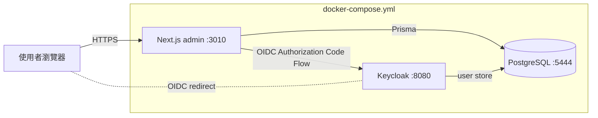
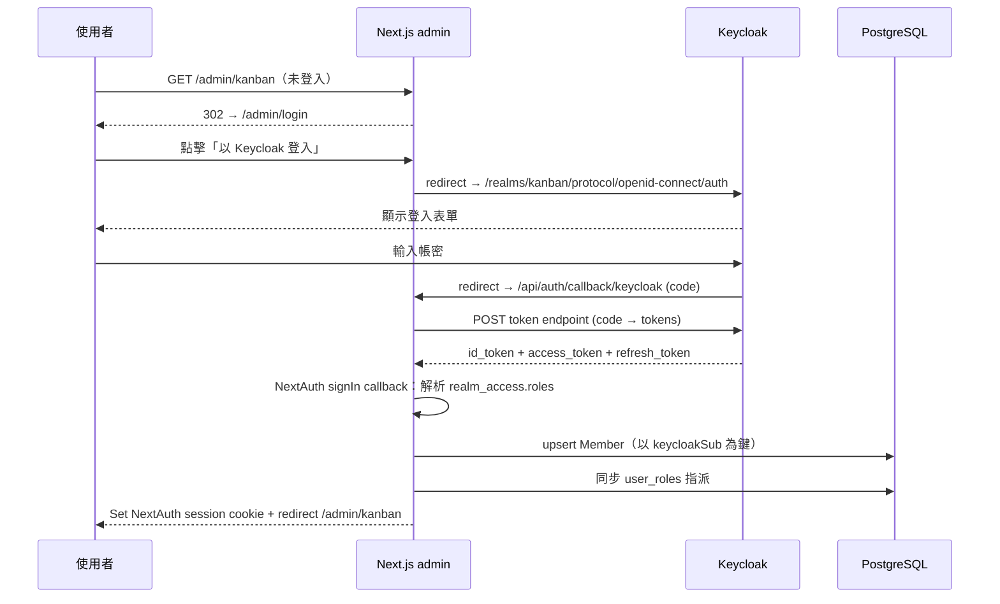
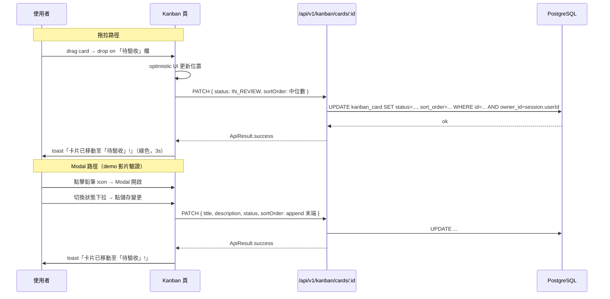
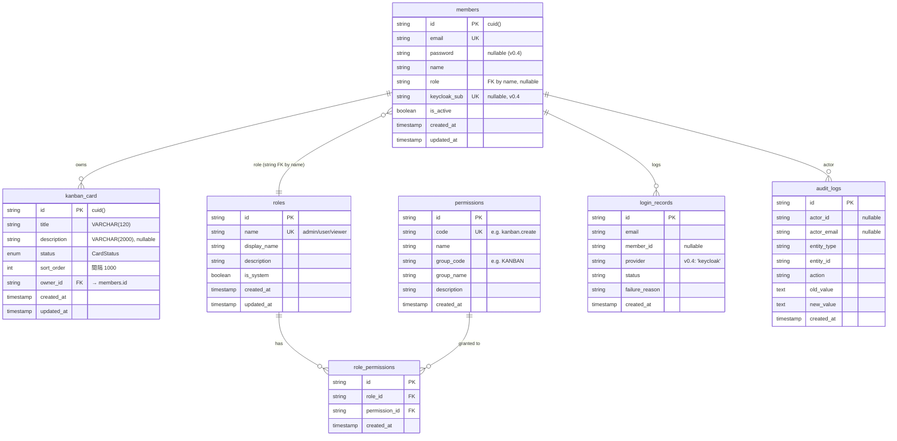

# Plan: Kanban 看板 + Keycloak SSO + i18n + 權限管理 UI

> 建立日期: 2026-04-25
> 狀態: 🔵 進行中
> 優先級: 🔴 高（面試作業，有交付期限）

---

## 關聯 PRD

> **PRD**: `docs/requirements/completed/20260423-001-kanban-board.md`（v0.4，✅ 已確認 2026-04-25）
>
> 本 Plan 的「目標」、「背景」、「受影響子專案」章節需與 PRD 對齊；若發現 PRD 有遺漏或需要調整，請回頭更新 PRD 並重新確認。

⚠️ **本次有資料庫異動** — 影響 3 張資料表（新增 `KanbanCard`、修改 `Member`、擴充 `Permission` seed）。詳見「資料表異動」章節。

---

## 目標

在既有 Azeroth 後台骨架（Next.js 15 + Prisma + RBAC）上交付一個完整可運作的個人 Kanban 看板系統，含：

1. **Kanban 核心**：4 欄位、卡片 CRUD、跨欄與欄內拖拉
2. **企業 SSO**：以 Keycloak OIDC 取代既有 Credentials 帳密登入
3. **權限管理 UI**：admin 可在 UI 勾選 Role 持有的 permissions
4. **多語系（i18n）**：zh-TW / en，含 API 錯誤訊息透過 `ApiErrorCode` 翻譯
5. **響應式（RWD）**：桌機 / 平板 / 手機三級斷點 + 觸控拖拉
6. **一鍵啟動**：`docker compose up -d` 完成 PostgreSQL + Keycloak + admin 全部初始化

## 背景

面試作業要求以「Kanban 看板」為主軸展示 vibe coding 能力。原始作業說明只有 4 欄位 / CRUD / 拖拉，使用者擴充了 Keycloak SSO、i18n、權限管理 UI、RWD、自動初始化等需求，藉此呈現完整工程能力。

PRD 在 v0.4 階段已透過 chrome-devtools MCP 抽取使用者提供的 demo 影片（`Kanban-demo.mp4`，12 張幀），確認以下關鍵 UX：
- 新增卡片採頁面頂端 inline 表單（非 Modal）
- 編輯走 Modal（含 emoji 狀態下拉）
- 卡片 hover 浮現右上鉛筆 + 垃圾桶 icon
- 操作後右上 toast 反饋（綠色成功 / 紅色失敗）

> 參考知識：（無，本專案 `docs/knowledge/` 目前為空）

## 系統分析

### 系統目標

- **可用性**：使用者透過 Keycloak SSO 登入後，5 秒內可完成第一張卡片建立
- **可維護性**：UI 文字 100% 走 i18n 字典，未來加語言只需新增 `messages/{locale}.json`
- **可重現性**：`docker compose down -v` 後再 `up`，60–90 秒內完成所有初始化並可登入
- **效能**：Kanban CRUD API p95 < 200ms（單機本地）

### 利害關係人

| 角色 | 關注點 | 需求 |
| --- | --- | --- |
| 面試評審 | 工程能力的整體完整度（架構、文件、可運行性） | 一鍵啟動可體驗、AI 協作紀錄齊全、程式碼風格一致 |
| admin 使用者 | 系統可運維、權限可調整 | UI 可調整 Role-Permission、可看稽核 / 登入紀錄 |
| user 使用者 | 看板易用、行動裝置可用 | 拖拉流暢、文字可雙語、響應式無斷裂 |
| viewer 使用者 | 唯讀檢視 | 不出現編輯按鈕、操作不報錯 |

## 方案概述

採「Monorepo 內依 prisma → common → admin 順序開發 + docker-compose 多服務統合」的方式：

1. **資料層先行**：先在 `prisma/schema.prisma` 補齊 `KanbanCard` model、`Member.keycloakSub` 欄位、`CardStatus` enum；產出 migration
2. **共用型別**：在 `common/src/` 新增 `ApiErrorCode` 常數物件並擴充 `ApiResult<T>` 介面
3. **後端先 SSO 後 Kanban**：先把 NextAuth Credentials provider 換成 Keycloak provider（含 signIn / jwt callback、Member upsert），確認可登入；再開 Kanban CRUD API
4. **前端按頁面拆**：登入頁改造 → Layout i18n 整合 → Kanban 頁面（含 dnd-kit）→ Role 編輯頁的 Permission 勾選 UI
5. **i18n 與 RWD 與 Kanban 平行**：邏輯完成後，i18n 走頁面字串 sweep + LocaleSwitcher 元件；RWD 走 Tailwind breakpoint 調整與 PointerSensor 補強
6. **一鍵啟動最後組裝**：`docker-compose.yml` 新增 keycloak service、admin entrypoint script、healthcheck

### 方案比較

| 議題 | 方案 | 結論 |
| --- | --- | --- |
| 認證方式 | (A) 保留 Credentials + bcrypt / (B) **改 Keycloak OIDC** | ✅ B（PRD Q1 決議） |
| i18n library | (A) **next-intl** / (B) react-i18next / (C) 自製 t() | ✅ A（PRD Q12 決議） |
| 錯誤訊息翻譯 | (A) 後端翻譯 / (B) **errorCode 雙碼制前端翻譯** | ✅ B（PRD Q13 決議） |
| 新增卡片 UI | (A) Modal / (B) **inline 表單** | ✅ B（PRD Q6 v0.4 修訂，依 demo） |
| Permission 管理 | (A) 僅 seed / (B) **指派既有 Permission 給 Role** / (C) Permission 全 CRUD | ✅ B（PRD Q10 決議） |
| 拖拉 library | (A) **@dnd-kit** / (B) react-dnd | ✅ A（已有 KeyboardSensor、PointerSensor 完整生態） |
| sortOrder 策略 | (A) **整數 + 1000 間隔** / (B) 浮點數 / (C) LexoRank | ✅ A（夠用、簡單；面試規模不需 LexoRank） |

## 系統架構

### 技術選型

| 項目 | 選擇 | 理由 | 替代方案 |
| --- | --- | --- | --- |
| 後端 | Next.js 15 App Router + API Route | 沿用既有 | — |
| ORM | Prisma 6 | 沿用既有 | — |
| 資料庫 | PostgreSQL 16 | 沿用既有 | — |
| 認證 | NextAuth v5 + Keycloak Provider（OIDC） | PRD 指定 | NextAuth Credentials（被取代） |
| Identity Provider | Keycloak 26.x（Quarkus distribution） | 業界標準 OIDC IdP，docker 易部署 | Auth0（雲服務不適合本地）、Casdoor |
| 前端 | React 19 + Tailwind 3.4 + RizzUI | 沿用既有 | — |
| 拖拉 | `@dnd-kit/core@^6` + `@dnd-kit/sortable@^7` | 完整 Sensor 生態（Pointer / Keyboard / Touch），App Router 友善 | react-dnd（HTML5 backend 不支觸控） |
| i18n | `next-intl@^4` | Next.js 15 官方推薦，Server Component / `[locale]` segment 完整支援 | react-i18next（App Router 整合複雜） |
| 表單驗證 | react-hook-form + Zod | 沿用既有 | — |
| Toast | RizzUI `Toaster` 或 `react-hot-toast` | 視 RizzUI 提供與否決定 | — |
| 部署 | Docker Compose（postgres + keycloak + admin） | 一鍵啟動需求 | — |

### 系統架構圖



### 認證流程（Keycloak OIDC）



### Kanban 狀態變更流程



## 角色與權限

| 角色 | 可存取資源 | 可執行操作 | 限制 |
| --- | --- | --- | --- |
| `admin` | 所有 admin 後台頁 + Kanban 頁 | 所有 CRUD + 編輯 RolePermission + 看稽核 / 登入紀錄 | Kanban 仍受 ownerId 過濾（看自己的卡片） |
| `user` | Kanban 頁 + 個人頁（/admin/me） | Kanban CRUD（自己的卡片） | 無後台管理權限 |
| `viewer` | Kanban 頁（唯讀）+ 個人頁 | 僅檢視自己的卡片 | 不顯示新增 inline 表單；卡片無 hover icons |

> **權限實作對應**：
> - 後端 API：以 `withPermission('kanban.create' | 'kanban.edit' | 'kanban.delete' | 'role_permissions.edit')` 守衛
> - 前端頁面：以 `usePermission()` hook 條件性顯示 inline 表單與 hover icons
> - 跨使用者隔離：所有 Kanban 查詢一律 `where: { ownerId: session.userId }`，admin 也不例外

## 受影響子專案

| 子專案 | 影響類型 | 說明 |
| --- | --- | --- |
| `prisma` | 修改 | `schema.prisma` 新增 `KanbanCard` model + `CardStatus` enum；`Member` 加 `keycloakSub` unique，`password` 改 optional；`prisma/seed.ts` 擴充 Permission（12 → 14）與 RolePermission 配置 |
| `common` | 新增 + 修改 | `src/api-error-code.ts` 新增；`src/api-response.ts` 擴充 `ApiResult<T>` 加 `errorCode?` |
| `admin` | 大幅修改 | 認證從 Credentials → Keycloak（`auth.ts`、`middleware.ts`、登入頁改造）；新增 `/admin/kanban` 頁、Kanban API、`/admin/roles/:id` Permission 勾選 UI、i18n（`[locale]` 路由 + `messages/*.json`）、`<LocaleSwitcher />` 元件、toast 系統、dnd-kit 整合 |
| `keycloak/`（新增資料夾） | 新增 | `realm-export.json`：含 client `kanban-admin`、roles `admin/user/viewer`、3 組預設使用者 |
| `docker-compose.yml` | 修改 | 新增 `keycloak` service + healthcheck；admin entrypoint 跑 migrate / seed |

## 資料表異動（Database Schema Changes）

⚠️ **本次有資料庫異動** — 受影響資料表：`kanban_card`（**新增**）、`members`（**修改**）、`permissions`（**seed 擴充**）、`role_permissions`（**seed 重建**）。

### 異動總表

| 資料表名稱 | 異動類型 | 說明 |
| --- | --- | --- |
| `kanban_card` | **新增資料表** | 個人 Kanban 卡片，含 status / sortOrder / ownerId 與複合索引 |
| `members` | **修改欄位** | `password` 由 NOT NULL → nullable（移交 Keycloak）；新增 `keycloak_sub` unique 欄位 |
| `permissions` | **新增資料** | seed 擴充 6 筆（kanban.* 4 筆 + role_permissions.* 2 筆） |
| `role_permissions` | **重建資料** | seed 依新 § 3.2 矩陣重新指派（admin 14 筆、user 4 筆、viewer 1 筆） |
| `roles` | 無 schema 變更 | seed `manager` → `user`（rename），`displayName` 同步更新 |
| `audit_logs` | 無 | 沿用既有 |
| `login_records` | 無 | 沿用既有 |

### ERD（含本次新增）



### 新增資料表：`kanban_card`

```prisma
// prisma/schema.prisma（新增）

enum CardStatus {
  TODO
  IN_PROGRESS
  IN_REVIEW
  DONE
}

model KanbanCard {
  id          String     @id @default(cuid())
  title       String     @db.VarChar(120)
  description String?    @db.VarChar(2000)
  status      CardStatus @default(TODO)
  sortOrder   Int        @map("sort_order")
  ownerId     String     @map("owner_id")
  createdAt   DateTime   @default(now()) @map("created_at")
  updatedAt   DateTime   @updatedAt        @map("updated_at")

  owner Member @relation(fields: [ownerId], references: [id], onDelete: Cascade)

  @@index([ownerId, status, sortOrder], name: "idx_owner_status_order")
  @@map("kanban_card")
}
```

**欄位明細**：

| 欄位 | 型別 | 可 NULL | 預設 | 索引 | 說明 |
| --- | --- | --- | --- | --- | --- |
| `id` | `TEXT` (cuid) | 否 | `cuid()` | PK | 卡片識別碼 |
| `title` | `VARCHAR(120)` | 否 | — | — | 卡片標題（最多 120 字） |
| `description` | `VARCHAR(2000)` | **是** | — | — | 卡片描述（選填，最多 2000 字） |
| `status` | `CardStatus` enum | 否 | `TODO` | composite | `TODO` / `IN_PROGRESS` / `IN_REVIEW` / `DONE` |
| `sort_order` | `INTEGER` | 否 | — | composite | 欄內排序值；新增 / 移動時間隔 1000 取中位數 |
| `owner_id` | `TEXT` | 否 | — | composite + FK | 卡片擁有者；FK → `members.id` ON DELETE CASCADE |
| `created_at` | `TIMESTAMP` | 否 | `now()` | — | 卡片建立時間，由 DB 自動寫入；用於 audit log 與「最近建立」排序備援 |
| `updated_at` | `TIMESTAMP` | 否 | `@updatedAt` | — | 卡片最近修改時間，Prisma `@updatedAt` 於每次 update 自動刷新；用於樂觀鎖 / 衝突偵測備援 |

**複合索引**：`(owner_id, status, sort_order)` — 對應主要查詢「載入某使用者的看板，按欄分組、欄內排序」：

```sql
SELECT * FROM kanban_card
WHERE owner_id = $1
ORDER BY status, sort_order;
```

**sortOrder 算法**（簡化版）：

| 操作 | 計算方式 |
| --- | --- |
| 新增卡片 → 落「待處理」末端 | `MAX(sort_order WHERE owner=u AND status=TODO) + 1000`，無同欄卡片時為 `1000` |
| 拖拉 / 改狀態 → 落新欄末端 | 同上，依目標 status |
| 拖拉至兩卡片之間 | `(prev.sort_order + next.sort_order) / 2` |
| 拖拉至首位 | `next.sort_order - 1000`，若 `< 1` 則觸發 normalize（重排同欄為 1000, 2000, ...） |
| 拖拉至末位 | `prev.sort_order + 1000` |

> **Normalize 觸發點**：當欄內某兩相鄰卡片 sortOrder 差距 < 2，下次插入會找不到中位數整數 → 觸發批次 UPDATE 將該欄全部重排為 1000, 2000, 3000... 面試規模 < 100 張卡片，極少觸發。

### 修改資料表：`members`

```diff
 model Member {
   id           String   @id @default(cuid())
   email        String   @unique
-  password     String
+  password     String?
   name         String
   isActive     Boolean  @default(true) @map("is_active")
   role         String?
+  keycloakSub  String?  @unique @map("keycloak_sub")
   createdAt    DateTime @default(now()) @map("created_at")
   updatedAt    DateTime @updatedAt @map("updated_at")

+  kanbanCards  KanbanCard[]

   @@index([isActive])
   @@map("members")
 }
```

**異動明細**：

| 欄位 | 異動 | 理由 |
| --- | --- | --- |
| `password` | `String` → `String?`（NOT NULL → NULLABLE） | 走 OIDC 後密碼移交 Keycloak，本表不再強制有密碼；既有 rows 因為已有值不受影響 |
| `keycloakSub` | **新增** `String? @unique @map("keycloak_sub")` | Keycloak 使用者唯一識別 `sub` claim；首次 SSO 登入時 upsert，nullable 容許舊資料未補 |
| `kanbanCards` | **新增**反向 relation | Prisma 編譯需要，對應 `KanbanCard.owner` |

**單角色設計（v0.4 維持現狀）**：
- 既有 `Member.role` 為單一字串（非 join table），值對應 `Role.name`
- Keycloak `realm_access.roles` 為陣列；signIn callback **依優先級挑一個**：`admin > user > viewer`
- 不新增 `MemberRole` join table（KISS 原則，PRD 未要求 multi-role）

### `permissions` seed 擴充（資料層異動，非 schema 異動）

依 `prisma/seed.ts` 用 `upsert` 補入 6 筆新權限（既有 8 筆 + 新增 6 筆 = **14 筆**）：

```typescript
const permissions: Array<Pick<Permission, 'code' | 'name' | 'groupCode' | 'groupName' | 'description'>> = [
  // 既有（8 筆）
  { code: 'roles.view',          groupCode: 'ROLES',          groupName: '角色管理',     name: '檢視角色',     description: '檢視角色列表' },
  { code: 'roles.create',        groupCode: 'ROLES',          groupName: '角色管理',     name: '新增角色',     description: '新增角色' },
  { code: 'roles.edit',          groupCode: 'ROLES',          groupName: '角色管理',     name: '編輯角色',     description: '編輯角色' },
  { code: 'roles.delete',        groupCode: 'ROLES',          groupName: '角色管理',     name: '刪除角色',     description: '刪除角色' },
  { code: 'user_roles.view',     groupCode: 'USER_ROLES',     groupName: '使用者角色',   name: '檢視使用者角色', description: '檢視使用者-角色指派' },
  { code: 'user_roles.edit',     groupCode: 'USER_ROLES',     groupName: '使用者角色',   name: '編輯使用者角色', description: '指派 / 調整使用者角色' },
  { code: 'audit_logs.view',     groupCode: 'AUDIT',          groupName: '稽核',         name: '檢視稽核紀錄',  description: '檢視稽核紀錄' },
  { code: 'login_records.view',  groupCode: 'AUDIT',          groupName: '稽核',         name: '檢視登入紀錄',  description: '檢視登入紀錄' },
  // 新增（v0.4，6 筆）
  { code: 'kanban.view',         groupCode: 'KANBAN',         groupName: '看板',         name: '檢視看板',      description: '進入 Kanban 並檢視自己的卡片' },
  { code: 'kanban.create',       groupCode: 'KANBAN',         groupName: '看板',         name: '新增卡片',      description: '建立新卡片' },
  { code: 'kanban.edit',         groupCode: 'KANBAN',         groupName: '看板',         name: '編輯卡片',      description: '編輯卡片（含拖拉改狀態 / 排序）' },
  { code: 'kanban.delete',       groupCode: 'KANBAN',         groupName: '看板',         name: '刪除卡片',      description: '刪除卡片' },
  { code: 'role_permissions.view', groupCode: 'ROLE_PERMISSIONS', groupName: '角色權限', name: '檢視角色權限',  description: '檢視 Role-Permission 指派' },
  { code: 'role_permissions.edit', groupCode: 'ROLE_PERMISSIONS', groupName: '角色權限', name: '編輯角色權限',  description: '在 UI 指派 Role 持有的 permissions' },
];
```

### `role_permissions` seed 重建（依 PRD § 3.2 矩陣）

| Role | Permissions（共幾筆） | 詳情 |
| --- | --- | --- |
| `admin` | 14 筆 | 全部 14 個 permissions |
| `user` | 4 筆 | `kanban.view` / `kanban.create` / `kanban.edit` / `kanban.delete` |
| `viewer` | 1 筆 | `kanban.view` |

`prisma/seed.ts` 以 `upsert(roleId + permissionId)` 寫入；既有 `manager` role 透過 `prisma.role.update({ where: { name: 'manager' }, data: { name: 'user', displayName: '一般使用者' } })` 改名（若已存在 `user` 則跳過）。

### Migration 注意事項

- [x] **down migration**：自動由 Prisma 生成（`prisma migrate diff` / `migrate reset`）
- [x] **影響現有資料**：
  - `members.password` 由 NOT NULL → NULLABLE：既有 row 因有值不受影響
  - `members.keycloak_sub` 新增為 nullable + unique：既有 row 為 null（首次 SSO 登入時填入）
  - `roles` rename `manager` → `user`：依現況實際是否有 `manager` row 決定（seed 階段 upsert 處理）
- [x] **新增複合索引** `kanban_card(owner_id, status, sort_order)` — 主查詢效能
- [x] **FK 約束** `kanban_card.owner_id → members.id ON DELETE CASCADE` — 刪除使用者時連帶刪卡片
- [x] **資料保留**：`audit_logs` / `login_records` 不動，保留歷史紀錄
- [x] **大資料表**：本案資料量小（< 1000 row），無 non-blocking migration 需求

### Migration 指令對照

```bash
# 開發階段：產生 migration 檔
npm run prisma:migrate -- --name add_kanban_and_keycloak_support

# 重置（清空 + 重跑全部 migration + seed）— docker compose down -v 後等效
npm run prisma:reset

# Production 部署（docker entrypoint 執行）
npx prisma migrate deploy
npx prisma db seed
```

## WBS（Work Breakdown Structure）

| 階段 | 工作包 | 對應 Spec | 預估工時 | 相依 |
| --- | --- | --- | --- | --- |
| 1. 資料層 | 1.1 Prisma schema + migration + seed 擴充 | A | 0.5d | — |
| 1. 資料層 | 1.2 `common/src/api-error-code.ts` 新增 + `ApiResult` 擴充 | A | 0.25d | — |
| 2. 認證 | 2.1 NextAuth Keycloak provider + signIn / jwt callback | A | 0.5d | 1.1 |
| 2. 認證 | 2.2 登入 / 登出頁改造 + middleware | A | 0.25d | 2.1 |
| 2. 認證 | 2.3 Role-Permission 勾選 UI（`/admin/roles/:id`） | A | 0.5d | 2.1 |
| 3. Kanban | 3.1 `/api/v1/kanban/cards/*` CRUD + reorder | B | 0.5d | 1.1, 1.2 |
| 3. Kanban | 3.2 `/admin/kanban` 頁面（inline 表單 + 4 欄 + 卡片） | B | 0.75d | 3.1 |
| 3. Kanban | 3.3 編輯 Modal（含 emoji 狀態下拉） | B | 0.25d | 3.2 |
| 3. Kanban | 3.4 dnd-kit 整合（PointerSensor + KeyboardSensor + sortable） | B | 0.5d | 3.2 |
| 3. Kanban | 3.5 Toast 系統（成功 / 失敗 / errorCode 翻譯） | B | 0.25d | 3.2 |
| 4. RWD | 4.1 Tailwind breakpoint 設計（桌機 / 平板 / 手機）+ Modal 全螢幕 | C | 0.5d | 3.2 |
| 4. RWD | 4.2 觸控拖拉強化（PointerSensor 長按啟動） | C | 0.25d | 3.4 |
| 5. i18n | 5.1 `next-intl` 整合 + `[locale]` segment routing | D | 0.5d | 2.2 |
| 5. i18n | 5.2 `messages/zh-TW.json` + `messages/en.json` 翻譯字典 | D | 0.5d | 5.1 |
| 5. i18n | 5.3 `<LocaleSwitcher />` chip / dropdown 元件 | D | 0.25d | 5.1 |
| 5. i18n | 5.4 errorCode → 翻譯 helper + 套用至 toast 系統 | D | 0.25d | 3.5, 5.2 |
| 6. 部署 | 6.1 `keycloak/realm-export.json` + `docker-compose.yml` keycloak service | A | 0.5d | 2.1 |
| 6. 部署 | 6.2 admin entrypoint script（migrate + seed + start） | A | 0.25d | 1.1, 6.1 |
| 6. 部署 | 6.3 README + `.env.example` + 自我驗證 | A | 0.25d | 6.1, 6.2 |
| 7. 驗收 | 7.1 全 AC 手動跑過一次（從 docker compose down -v 開始） | — | 0.5d | 全部 |

**總計工時估算**：約 7–8 人日。

## 拆解的 Spec 清單

| Spec 檔名 | 狀態 | 範圍說明 |
| --- | --- | --- |
| `docs/specs/doing/20260425-001-keycloak-auth-and-deployment.spec.md` | ✅ | **Spec A** — Prisma schema + Keycloak SSO 遷移 + Role-Permission 管理 UI（重用既有）+ docker-compose 一鍵啟動 |
| `docs/specs/doing/20260425-002-kanban-core.spec.md` | ✅ | **Spec B** — Kanban API（CRUD + move）+ 看板頁（inline 表單 + 4 欄 + 編輯 Modal + dnd-kit + toast） |
| `docs/specs/doing/20260425-003-rwd-and-touch-drag.spec.md` | ✅ | **Spec C** — TouchSensor + 行動版水平捲動 + Modal bottom-sheet |
| `docs/specs/doing/20260425-004-i18n-error-code-translation.spec.md` | ✅ | **Spec D** — `errors.{code}` 字典 + `tApiError` helper + Kanban toast 雙碼制翻譯（不遷移 next-intl，保留既有 useTranslation hook） |

**開發順序**：Spec A → Spec B → Spec C / Spec D（C 與 D 可部分並行；D 的 errorCode helper 需 B 的 toast 系統先就緒）。

## 驗收條件

依 PRD § 8 成功指標：

- [ ] PRD AC 1.1 ~ 10.5 全部可手動驗證通過
- [ ] `npm run type:check` 與 `npm run lint` 無錯誤
- [ ] `npm run build` 成功（含 next-intl messages 編譯）
- [ ] `docker compose down -v && docker compose up -d` 60–90 秒內可登入
- [ ] `npm run prisma:migrate` 可產出 KanbanCard 表 + Member schema 調整
- [ ] `npm run prisma:seed` 可建立 3 個角色與 14 個權限
- [ ] Keycloak realm import 完成後，`admin@example.com / Admin@1234` 可登入並見 Kanban 頁
- [ ] Spec A / B / C / D 各自的 AI 協作紀錄齊全
- [ ] 所有 ✅ 狀態文件（PRD / Plan / Spec）於 SessionEnd 由 Hook 正確歸檔

## AI 協作紀錄

### 目標確認

依使用者已確認的 PRD v0.4，建立可執行的 Plan 文件，明確：
- 4 份 Spec 的範圍與順序
- 跨子專案的影響（prisma → common → admin → keycloak/docker）
- 資料庫異動（已主動告知使用者）
- WBS 與工時估算（約 7–8 人日）

### 關鍵問答

#### 是否所有 4 份 Spec 同時建立？

**AI 回應摘要**：依 spec-before-code 規則，Spec 為「按需建立」，每份建立後需使用者確認才放行 Edit/Write。本 Plan 只列清單，實際 Spec 等使用者確認 Plan 後再建第一份（Spec A）。

#### 資料庫異動的告知時機？

**AI 回應摘要**：依 Write-doc-before-Code 硬性規範，Plan 確認時必須主動告知。本 Plan 已在開頭與「資料表異動」章節以 ⚠️ 標示影響的 4 張資料表（kanban_card 新增、member 修改、permission 與 role_permission seed 擴充）。

### 決策記錄

| 決策 | 結果 | 理由 |
| --- | --- | --- |
| Spec 拆分 4 份（A 認證+部署 / B Kanban 核心 / C RWD / D i18n） | ✅ 採納 | A/B/C 為原 PRD 拆分；D 為 v0.4 新增 i18n 獨立 Spec |
| Spec A 把 Role-Permission 管理 UI 併入而非獨立 Spec | ✅ 採納 | 同屬「認證授權」層級，避免拆 5 份 Spec 過散 |
| 開發順序 A → B → C/D 並行 | ✅ 採納 | A 是依賴根（DB schema + 認證）；C 純 CSS / sensor 調整可與 D i18n 平行 |
| sortOrder 用整數 + 1000 間隔，非 LexoRank | ✅ 採納 | 面試規模卡片數 < 100，整數中位數即可；中位數衝突時觸發欄內 normalize（後續可加） |
| Member.password 改 optional 而非移除 | ✅ 採納 | 向前相容既有 schema；移除欄位需資料遷移風險高 |
| `keycloak_sub` 為 unique nullable | ✅ 採納 | 既有 Member rows 容許 sub null（直到首次 SSO 登入填入）；新增 SSO Member 一律帶 sub |

### 產出摘要

- 本 Plan 文件
- 後續 Spec A / B / C / D 將依序建立至 `docs/specs/doing/`
- 預計實際開發時程：~7–8 人日
