# Azeroth 面試作業 — Kanban 網站開發實作過程
---

## 1. 架構選型

評估順序：

1. **案子規模及開發人力**：簡易看板，CRUD + 拖拉，輕量。
2. **使用者量級**：個人使用，無高併發需求。
3. **目前團隊對於此技術的熟悉度**
4. **3 年成長性**：目前少量使用者夠用，未來若擴成多人協作，Next.js 全端 + PG 仍可水平延伸，複雜運算或排程服務，可以搭配Nest Js 或c# 程式語言來輔助短版。

主要採用技術棧是
* Next.js：輕量的全端框架，可在同一個 repo 中整合 UI、API 與 SSR，提升開發與維護效率
* PostgreSQL：開源且功能完整，支援全文檢索、地理資訊（PostGIS）與 JSONB，具備良好的擴充彈性
* Prisma：強型別安全的 ORM，提升開發效率並降低資料庫操作錯誤風險
* Keycloak：負責身份驗證與授權（Auth / IAM），支援 OAuth2 / OpenID Connect，方便整合企業級登入機制
---

## 2. 程式碼基礎建設

### 2.1 沿用既有的 Theme 骨架

我平常會整理一些 Theme（含登入、RBAC、稽核、登入紀錄等基礎模組），所以這次直接拿最近開發的骨架來改。

### 2.2 資料夾擺放

採用 **Monorepo（npm workspaces）**：

- `common/` — 共用型別（`ApiResult` / `ApiReturnCode`）
- `admin/` — Next.js 後台（登入、RBAC、Kanban 頁面）
- `prisma/` — Schema 與 seed
- `docs/` — PRD / Plan / Spec / Bug / Log / Knowledge / Decision

### 2.3 定義 Coding Standard

把命名、型別、async、React、安全性、錯誤處理（`ApiResult` pattern）等規則寫成 `.claude/rules/coding-standards.md`，讓 AI 寫出來的程式碼有固定的規則。
---

## 3. 定義開發工作流：Write-doc-before-Code

這是我認為**和 AI 協作最關鍵的設計**。透過 Claude Code 的 Hook + Rules 強制走以下流程：

```
PRD（需求模糊時）→ Plan（SA + WBS）→ Spec（功能太大時拆）→ Code → Log → Knowledge
```

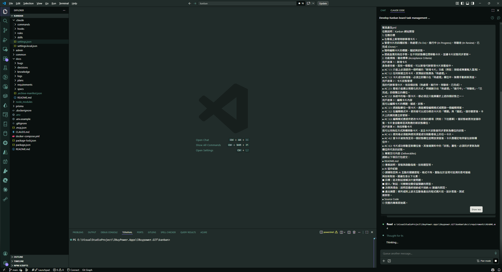
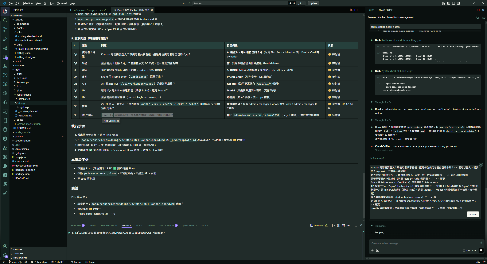
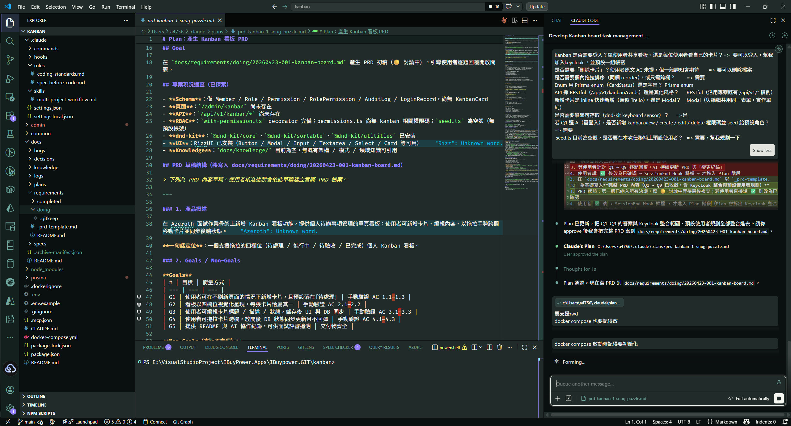

### 為什麼要這樣做？

| 問題 | 沒有工作流 | 有工作流 |
| --- | --- | --- |
| AI 自由發揮 | 寫一寫就偏題、改了一堆無關檔案 | 受 Spec 約束，只能改「受影響檔案」清單裡的檔 |
| 改動難追溯 | 只有 commit message | PRD / Plan / Spec / Log 串成完整脈絡 |
| 知識流失 | 改完就忘 | SessionEnd Hook 自動把已完成的文件歸檔 + 提煉知識 |
| 大功能難評估 | 一坨 todo | Plan 用 SA + WBS 評估，自動拆 Spec |

### Hook 的硬性攔截

- **PreToolUse（Edit/Write）**：要改程式碼前，必須先有一個 🔵 狀態的 Spec 且其「受影響檔案」清單包含該路徑，否則直接擋下。
- **PostToolUse**：追蹤被改動的檔案，回填 Spec 進度。
- **SessionEnd**：自動把標記 ✅ 的 PRD / Plan / Spec / Bug 從 `doing/` 歸檔到 `completed/`，並提煉知識到 `docs/knowledge/`。

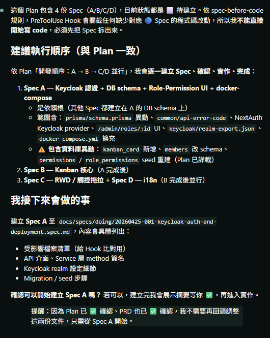

---

## 4. 製作 PRD

### 4.1 拿到題目後我會先停下來想

通常拿到 PRD 我會問自己幾個問題：

- 有沒有漏掉什麼？（角色權限、登入機制、多語系、RWD…）
- 有沒有怎麼做能讓系統更好？
- 哪些是這次該做、哪些是 Non-Goals？

首先，拿到工作，我先了解要做什麼，並將PDF 及影片餵給AI，產生PRD，調整PRD模擬和PM 討論的結果

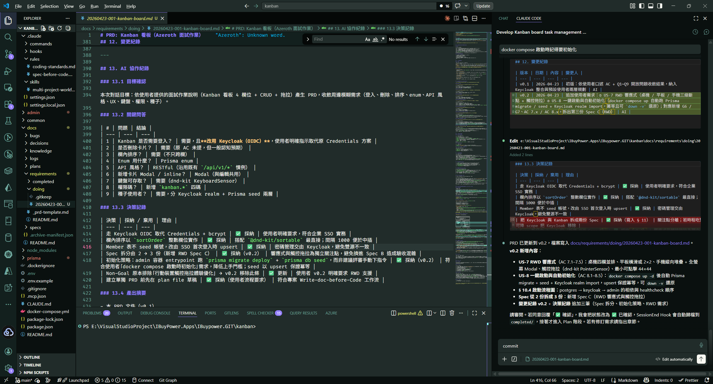

### 4.2 用 Chrome DevTools MCP 從影片抽影格來更新 PRD 及 UI細節

題目附的是影片，我請 Claude 用 **chrome-devtools MCP** 把影片打開，逐幀截圖，再回頭更新 PRD 的 UI 細節（欄位名稱、卡片樣式、拖拉互動等）。

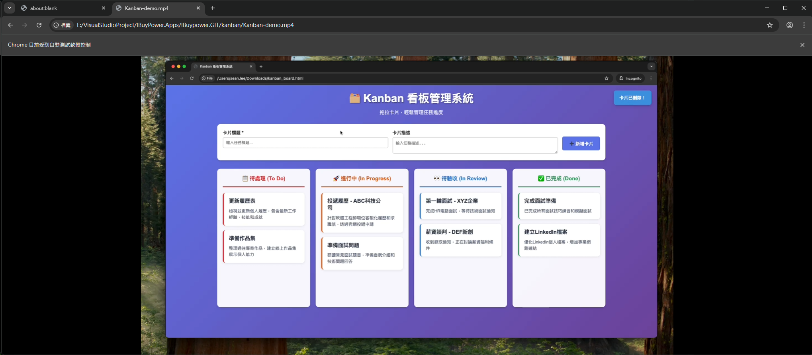

### 4.3 討論紀錄會自動回寫到 PRD

這是工作流的副產物：每一輪「我問 → AI 回 → 我確認」都會被當下回寫到 PRD 對應段落，所以 PRD 不只是需求，也是一份**決策歷史**。等到 PRD 確認後（標記 ✅），就會被 SessionEnd Hook 歸檔到 `requirements/completed/`。

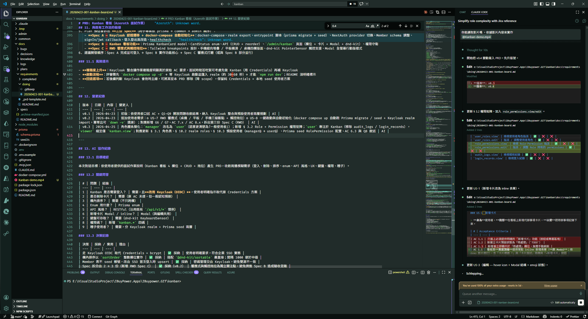

最終產物：[`docs/requirements/completed/20260423-001-kanban-board.md`](../docs/requirements/completed/20260423-001-kanban-board.md)

---

## 5. 從 PRD 來產生生 Plan（SA + WBS）

PRD 確認後，請 AI 依 Plan 範本產出 Plan，內容必含：

- **系統分析（SA）**：資料模型、API、頁面、互動流程（Mermaid 圖）
- **系統架構**：前後端分層、認證流程
- **角色與權限**：對應到 RBAC 矩陣
- **WBS**：把工作切成可估時的小塊
- **資料表異動**：Prisma schema 的 migration 注意事項

過程我會評估這個計畫的合理性，並不斷和AI 討論，直到可以執行，在執行時，如果 Plan 評估出某些工作太大，AI 會主動把它拆成多個 Spec。

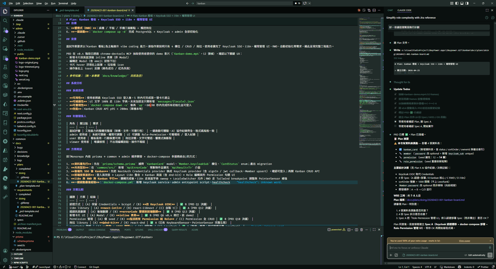

最終產物：[`docs/plans/completed/20260423-001-kanban-board.md`](../docs/plans/completed/20260423-001-kanban-board.md)

---

## 6. 實作：Plan 自動拆 Spec 後逐項執行

下指令大致是這樣：

> 「依據 `@docs/plans/doing/20260423-001-kanban-board.md` 這個計劃幫我實作。」

AI 會先掃 Plan 的 WBS，把功能拆成多個 Spec，每個 Spec 列出「受影響檔案」與驗收條件，逐一通過 PreToolUse Hook 後才動程式碼。

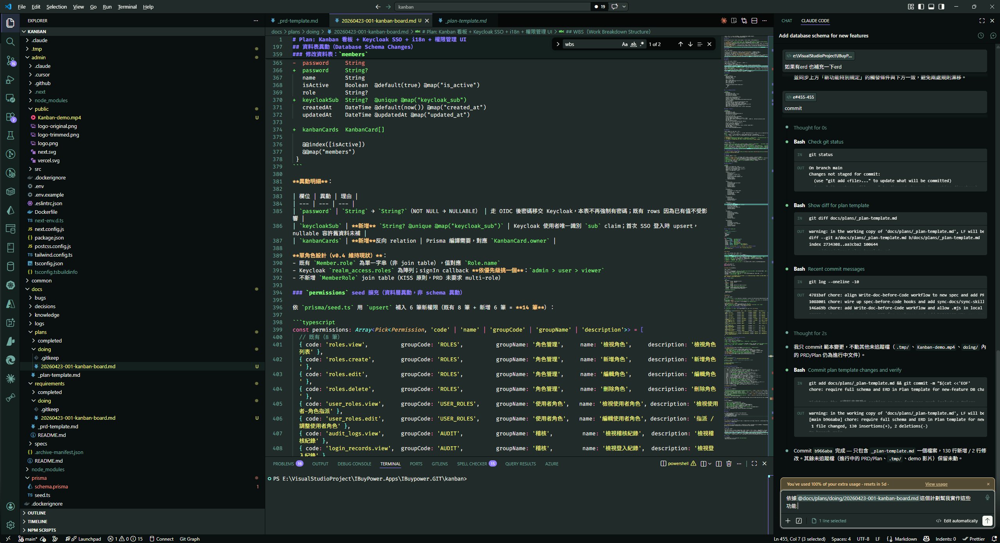

這次共產出 11 份 Spec（節錄）：

| Spec | 主題 |
| --- | --- |
| 20260425-001 | Keycloak Auth 與部署 |
| 20260425-002 | Kanban Core（CRUD + 四欄） |
| 20260425-003 | RWD 與觸控拖拉 |
| 20260425-004 | i18n Error Code 翻譯 |
| 20260425-005 | Dark Mode 灰階修正 |
| 20260425-007 | Me Page 卡片浮起效果 |
| 20260425-008 | 專案改名 Iqt → Azeroth |
| 20260426-001 | 修認證 Server 設定 |

---

## 7. 歸檔與提煉知識庫

每次 SessionEnd，Hook 會做兩件事：

1. **歸檔**：標記 ✅ 的 Plan / Spec / Bug 自動從 `doing/` 移到 `completed/`。
2. **提煉知識**：依 manifest 把可重用的設計決策、踩雷紀錄寫進 `docs/knowledge/`，並維護 `INDEX.md`。

下一次新功能要做時，AI 會先查知識庫，避免重蹈覆轍。

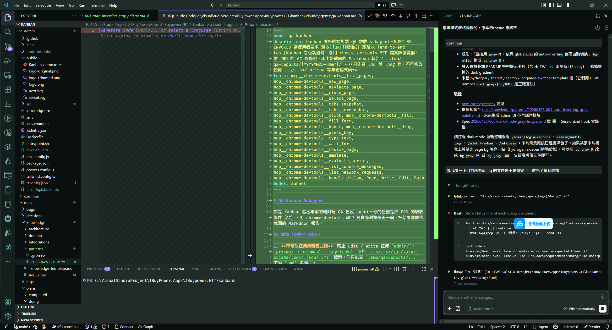

---

## 8. 部署

`docker compose up -d` 一鍵起：

- `postgres` 容器（port 5444）
- `admin` 容器（Next.js，port 3010）
- 啟動時自動跑 Prisma migration、seed、Keycloak realm import

驗收條件 G7：使用者 clone 後一條指令就能登入用，這是衡量「部署易用度」的 AC。

---

## 9. 驗收：測試

### 9.1 人工測試

測試AI實作的相關功能，看有沒有重大的錯誤，有的話請AI 先修正

### 9.2 請 Claude 使用 Chrome DevTools MCP 自動測試，這些實作的相關功能

請 Claude 開瀏覽器跑使用者旅程，截圖比對。

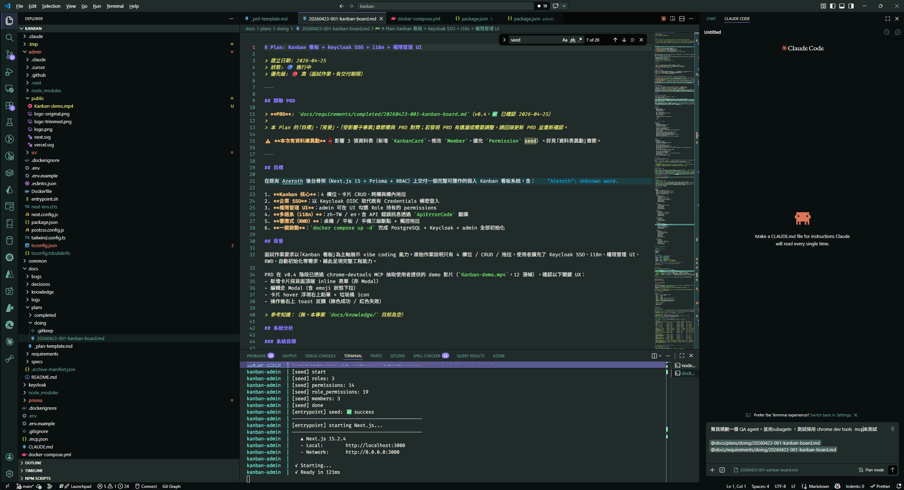

### 9.3 QA Agent 測試

依據前述的功能，請Claude 定義了一個 `qa-kanban` subagent，方便下次直接呼叫指令來測試： 

- 工具白名單只開 chrome-devtools MCP + Read/Write/Edit/Bash
- **禁止改業務程式碼**，只能讀 + 跑測試 + 寫報告
- 依 PRD 的 AC 逐條驗收，產出帶截圖的 Markdown 報告到 `.tmp/qa-reports/{YYYYMMDD-HHmm}/`
- 用 `/qa-kanban all`、`/qa-kanban smoke`、`/qa-kanban tier=1,2`、`/qa-kanban AC 4.3` 觸發不同範圍

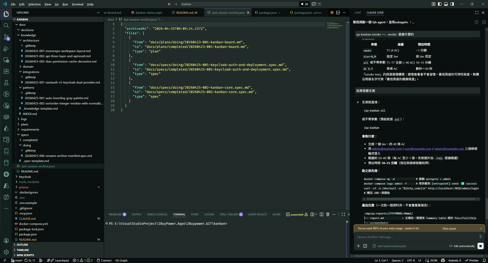

---

## 附錄：交付物對照表

| 類別 | 路徑 |
| --- | --- |
| PRD | [`docs/requirements/completed/20260423-001-kanban-board.md`](../docs/requirements/completed/20260423-001-kanban-board.md) |
| Plan | [`docs/plans/completed/20260423-001-kanban-board.md`](../docs/plans/completed/20260423-001-kanban-board.md) |
| Spec | [`docs/specs/completed/`](../docs/specs/completed/)（共 11 份） |
| 知識庫 | [`docs/knowledge/INDEX.md`](../docs/knowledge/INDEX.md) |
| 工作流規則 | [`.claude/rules/spec-before-code.md`](../.claude/rules/spec-before-code.md) |
| Coding Standard | [`.claude/rules/coding-standards.md`](../.claude/rules/coding-standards.md) |
| QA Subagent | [`.claude/agents/qa-kanban.md`](../.claude/agents/qa-kanban.md) |
| Hooks | [`.claude/hooks/`](../.claude/hooks/) |
| 專案說明 | [`README.md`](../README.md)、[`CLAUDE.md`](../CLAUDE.md) |
